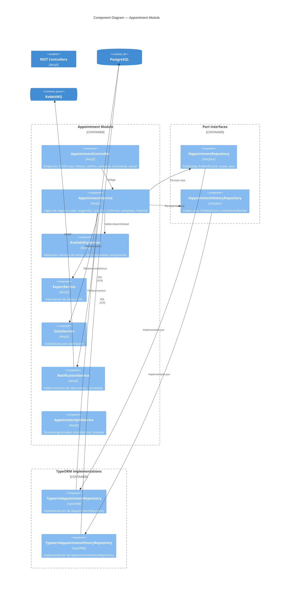

# Backend — Diagrama de Componentes: Gestión de Citas

```mermaid
C4Component
  title Component Diagram — Appointment Module

  Container(controllers, "REST Controllers", "NestJS")
  ContainerDb(postgres, "PostgreSQL")
  ContainerQueue(rabbitmq, "RabbitMQ")

  Container_Boundary(appointment_module, "Appointment Module") {
    Component(appt_controller, "AppointmentController", "NestJS", "Endpoints: CRUD citas, history, confirm, complete, reschedule, cancel")
    Component(appt_service, "AppointmentService", "NestJS", "Lógica de negocio: crear, reagendar, cancelar, confirmar, completar, historial")
    Component(availability_service, "AvailabilityService", "NestJS", "Validación: ventana de tiempo, slots disponibles, excepciones")
    Component(export_service, "ExportService", "NestJS", "Exportación de datos a CSV")
    Component(stats_service, "StatsService", "NestJS", "Estadísticas para dashboard")
    Component(notification_service, "NotificationService", "NestJS", "Publica eventos de citas (creada, cancelada)")
    Component(appt_job, "AppointmentJobService", "NestJS", "Tareas programadas: recordatorios, limpieza")
  }

  Container_Boundary(ports, "Port Interfaces") {
    Component(appt_repo, "IAppointmentRepository", "Interface", "findOneBy, findAndCount, create, save")
    Component(history_repo, "IAppointmentHistoryRepository", "Interface", "create, save, findAndCount, createQueryBuilder")
  }

  Container_Boundary(implementations, "TypeORM Implementations") {
    Component(appt_impl, "TypeormAppointmentRepository", "TypeORM", "Implementación de IAppointmentRepository")
    Component(history_impl, "TypeormAppointmentHistoryRepository", "TypeORM", "Implementación de IAppointmentHistoryRepository")
  }

  Rel(appt_controller, appt_service, "Delega")
  Rel(appt_service, availability_service, "Valida disponibilidad")
  Rel(appt_service, export_service, "Exporta datos")
  Rel(appt_service, notification_service, "Publica eventos")
  Rel(appt_service, stats_service, "Obtiene estadísticas")

  Rel(appt_service, appt_repo, "Persiste citas")
  Rel(appt_service, history_repo, "Persiste historial")
  Rel(appt_repo, appt_impl, "Implementado por")
  Rel(history_repo, history_impl, "Implementado por")
  Rel(appt_impl, postgres, "SQL", "TCP")
  Rel(history_impl, postgres, "SQL", "TCP")
  Rel(notification_service, rabbitmq, "AMQP")
```
