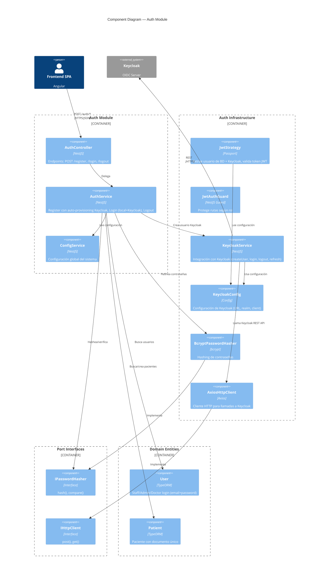

# Backend — Diagrama de Componentes: Autenticación

```mermaid
C4Component
  title Component Diagram — Auth Module

  Person(frontend, "Frontend SPA", "Angular")
  System_Ext(keycloak_ext, "Keycloak", "OIDC Server")

  Container_Boundary(auth_module, "Auth Module") {
    Component(auth_controller, "AuthController", "NestJS", "Endpoints: POST /register, /login, /logout")
    Component(auth_service, "AuthService", "NestJS", "Register con auto-provisioning Keycloak, Login (local+Keycloak), Logout")
    Component(config_service, "ConfigService", "NestJS", "Configuración global del sistema")
  }

  Container_Boundary(auth_infra, "Auth Infrastructure") {
    Component(jwt_strategy, "JwtStrategy", "Passport", "Extrae usuario de BD + Keycloak, valida token JWT")
    Component(jwt_guard, "JwtAuthGuard", "NestJS Guard", "Protege rutas según rol")
    Component(keycloak_svc, "KeycloakService", "NestJS", "Integración con Keycloak (createUser, login, logout, refresh)")
    Component(keycloak_cfg, "KeycloakConfig", "Config", "Configuración de Keycloak (URL, realm, client)")
    Component(bcrypt, "BcryptPasswordHasher", "bcrypt", "Hashing de contraseñas")
    Component(http_client, "AxiosHttpClient", "Axios", "Cliente HTTP para llamadas a Keycloak")
  }

  Container_Boundary(ports, "Port Interfaces") {
    Component(password_hasher, "IPasswordHasher", "Interface", "hash(), compare()")
    Component(http_client_iface, "IHttpClient", "Interface", "post(), get()")
  }

  Container_Boundary(entities, "Domain Entities") {
    Component(user_entity, "User", "TypeORM", "Staff/Admin/Doctor login (email+password)")
    Component(patient_entity, "Patient", "TypeORM", "Paciente con documento único")
  }

  Rel(frontend, auth_controller, "POST /auth/*", "HTTPS/JSON")
  Rel(auth_controller, auth_service, "Delega")
  Rel(auth_service, config_service, "Lee configuración")
  Rel(auth_service, keycloak_svc, "Crea usuario Keycloak")
  Rel(auth_service, bcrypt, "Hashea contraseñas")

  Rel(bcrypt, password_hasher, "Implementa")
  Rel(http_client, http_client_iface, "Implementa")

  Rel(jwt_strategy, keycloak_cfg, "Lee configuración")
  Rel(keycloak_svc, keycloak_cfg, "Usa configuración")
  Rel(keycloak_svc, http_client, "Llama Keycloak REST API")
  Rel(keycloak_svc, keycloak_ext, "REST", "HTTPS")

  Rel(auth_service, password_hasher, "Hashea/verifica")
  Rel(auth_service, user_entity, "Busca usuarios")
  Rel(auth_service, patient_entity, "Busca/crea pacientes")
```
