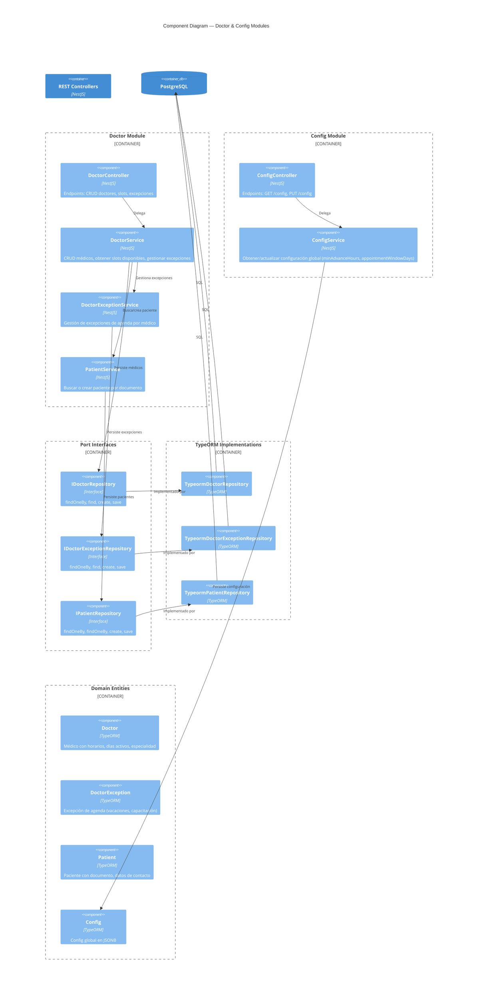

# Backend — Diagrama de Componentes: Médicos y Configuración

```mermaid
C4Component
  title Component Diagram — Doctor & Config Modules

  Container(controllers, "REST Controllers", "NestJS")
  ContainerDb(postgres, "PostgreSQL")

  Container_Boundary(doctor_module, "Doctor Module") {
    Component(doc_controller, "DoctorController", "NestJS", "Endpoints: CRUD doctores, slots, excepciones")
    Component(doc_service, "DoctorService", "NestJS", "CRUD médicos, obtener slots disponibles, gestionar excepciones")
    Component(exc_service, "DoctorExceptionService", "NestJS", "Gestión de excepciones de agenda por médico")
    Component(patient_service, "PatientService", "NestJS", "Buscar o crear paciente por documento")
  }

  Container_Boundary(config_module, "Config Module") {
    Component(cfg_controller, "ConfigController", "NestJS", "Endpoints: GET /config, PUT /config")
    Component(cfg_service, "ConfigService", "NestJS", "Obtener/actualizar configuración global (minAdvanceHours, appointmentWindowDays)")
  }

  Container_Boundary(ports, "Port Interfaces") {
    Component(doc_repo, "IDoctorRepository", "Interface", "findOneBy, find, create, save")
    Component(exc_repo, "IDoctorExceptionRepository", "Interface", "findOneBy, find, create, save")
    Component(patient_repo, "IPatientRepository", "Interface", "findOneBy, findOneBy, create, save")
  }

  Container_Boundary(implementations, "TypeORM Implementations") {
    Component(doc_impl, "TypeormDoctorRepository", "TypeORM")
    Component(exc_impl, "TypeormDoctorExceptionRepository", "TypeORM")
    Component(patient_impl, "TypeormPatientRepository", "TypeORM")
  }

  Container_Boundary(entities, "Domain Entities") {
    Component(doctor_entity, "Doctor", "TypeORM", "Médico con horarios, días activos, especialidad")
    Component(exc_entity, "DoctorException", "TypeORM", "Excepción de agenda (vacaciones, capacitación)")
    Component(patient_entity, "Patient", "TypeORM", "Paciente con documento, datos de contacto")
    Component(cfg_entity, "Config", "TypeORM", "Config global en JSONB")
  }

  Rel(doc_controller, doc_service, "Delega")
  Rel(doc_service, exc_service, "Gestiona excepciones")
  Rel(doc_service, patient_service, "Busca/crea paciente")
  Rel(cfg_controller, cfg_service, "Delega")

  Rel(doc_service, doc_repo, "Persiste médicos")
  Rel(exc_service, exc_repo, "Persiste excepciones")
  Rel(patient_service, patient_repo, "Persiste pacientes")
  Rel(cfg_service, cfg_entity, "Persiste configuración")

  Rel(doc_repo, doc_impl, "Implementado por")
  Rel(exc_repo, exc_impl, "Implementado por")
  Rel(patient_repo, patient_impl, "Implementado por")

  Rel(doc_impl, postgres, "SQL")
  Rel(exc_impl, postgres, "SQL")
  Rel(patient_impl, postgres, "SQL")
```
