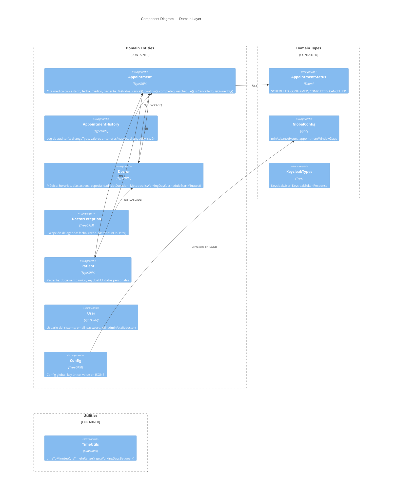

# Backend — Diagrama de Componentes: Capa de Dominio

```mermaid
C4Component
  title Component Diagram — Domain Layer

  Container_Boundary(entities, "Domain Entities") {
    Component(appointment, "Appointment", "TypeORM", "Cita médica con estado, fecha, médico, paciente. Métodos: cancel(), confirm(), complete(), reschedule(), isCancelled(), isOwnedBy()")
    Component(appt_history, "AppointmentHistory", "TypeORM", "Log de auditoría: changeType, valores anteriores/nuevos, changedBy, razón")
    Component(doctor, "Doctor", "TypeORM", "Médico: horarios, días activos, especialidad, slotDuration. Métodos: isWorkingDay(), scheduleStartMinutes()")
    Component(exceptions, "DoctorException", "TypeORM", "Excepción de agenda: fecha, razón. Método: isOnDate()")
    Component(patient, "Patient", "TypeORM", "Paciente: documento único, keycloakId, datos personales")
    Component(user, "User", "TypeORM", "Usuario del sistema: email, password, rol (admin/staff/doctor)")
    Component(config, "Config", "TypeORM", "Config global: key único, value en JSONB")
  }

  Container_Boundary(types, "Domain Types") {
    Component(status_enum, "AppointmentStatus", "Enum", "SCHEDULED, CONFIRMED, COMPLETED, CANCELLED")
    Component(global_config, "GlobalConfig", "Type", "minAdvanceHours, appointmentWindowDays")
    Component(keycloak_types, "KeycloakTypes", "Type", "KeycloakUser, KeycloakTokenResponse")
  }

  Container_Boundary(utils, "Utilities") {
    Component(time_utils, "TimeUtils", "Functions", "timeToMinutes(), isTimeInRange(), getWorkingDaysBetween()")
  }

  Rel(appointment, status_enum, "Usa")
  Rel(appointment, doctor, "N:1")
  Rel(appointment, patient, "N:1")
  Rel(appt_history, appointment, "N:1 (CASCADE)")
  Rel(exceptions, doctor, "N:1 (CASCADE)")
  Rel(patient, appointment, "1:N")
  Rel(doctor, appointment, "1:N")
  Rel(config, global_config, "Almacena en JSONB")
```
