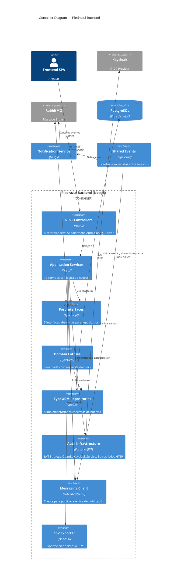

# Backend — Diagrama de Contenedores (C4 L2)

```mermaid
C4Container
  title Container Diagram — Piedrazul Backend

  Person(frontend, "Frontend SPA", "Angular")

  System_Ext(keycloak, "Keycloak", "OIDC Provider")
  System_Ext(rabbitmq, "RabbitMQ", "Message Broker")

  Container_Boundary(backend, "Piedrazul Backend (NestJS)") {
    Container(controllers, "REST Controllers", "NestJS", "4 controladores: Appointment, Auth, Config, Doctor")
    Container(services, "Application Services", "NestJS", "10 servicios con lógica de negocio")
    Container(ports, "Port Interfaces", "TypeScript", "5 interfaces abstractas para repositorios")
    Container(entities, "Domain Entities", "TypeORM", "7 entidades con reglas de dominio")
    Container(repositories, "TypeORM Repositories", "TypeORM", "5 implementaciones concretas de puertos")
    Container(auth, "Auth Infrastructure", "Passport/JWT", "JWT Strategy, Guards, Keycloak Service, Bcrypt, Axios HTTP")
    Container(messaging, "Messaging Client", "RabbitMQ/Redis", "Cliente para publicar eventos de notificación")
    Container(export, "CSV Exporter", "Json2Csv", "Exportación de datos a CSV")
  }

  ContainerDb(postgres, "PostgreSQL", "Base de datos")

  Container(notification_svc, "Notification Service", "NestJS")
  Container(shared_events, "Shared Events", "TypeScript", "Eventos compartidos entre servicios")

  Rel(frontend, controllers, "HTTP/REST", "HTTPS/JSON")
  Rel(controllers, services, "Delega a")

  Rel(services, ports, "Usa interfaces")
  Rel(ports, repositories, "Implementado por")
  Rel(repositories, postgres, "SQL", "TCP")
  Rel(entities, repositories, "Usado por")

  Rel(services, auth, "Autenticación y autorización")
  Rel(auth, keycloak, "Valida tokens y sincroniza usuarios", "OIDC/REST")
  Rel(services, messaging, "Publica eventos")
  Rel(messaging, rabbitmq, "AMQP", "RabbitMQ")
  Rel(notification_svc, rabbitmq, "Consume eventos", "AMQP")
  Rel(services, export, "Exporta datos")
  Rel(shared_events, messaging, "Define eventos")
  Rel(shared_events, notification_svc, "Define eventos")
```
