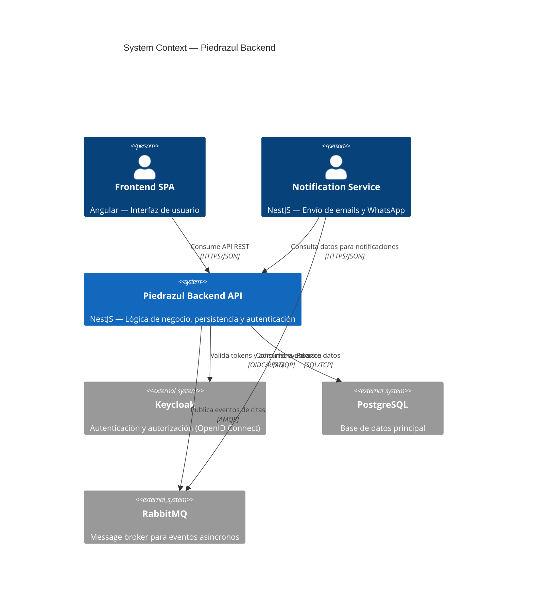

# Backend — Diagrama de Contexto (C4 L1)

```mermaid
C4Context
  title System Context — Piedrazul Backend

  Person(frontend, "Frontend SPA", "Angular — Interfaz de usuario")
  Person(notification_svc, "Notification Service", "NestJS — Envío de emails y WhatsApp")

  System(backend, "Piedrazul Backend API", "NestJS — Lógica de negocio, persistencia y autenticación")

  System_Ext(keycloak, "Keycloak", "Autenticación y autorización (OpenID Connect)")
  System_Ext(postgres, "PostgreSQL", "Base de datos principal")
  System_Ext(rabbitmq, "RabbitMQ", "Message broker para eventos asíncronos")

  Rel(frontend, backend, "Consume API REST", "HTTPS/JSON")
  Rel(backend, postgres, "Persiste datos", "SQL/TCP")
  Rel(backend, keycloak, "Valida tokens y administra usuarios", "OIDC/REST")
  Rel(backend, rabbitmq, "Publica eventos de citas", "AMQP")
  Rel(notification_svc, rabbitmq, "Consume eventos", "AMQP")
  Rel(notification_svc, backend, "Consulta datos para notificaciones", "HTTPS/JSON")
```
