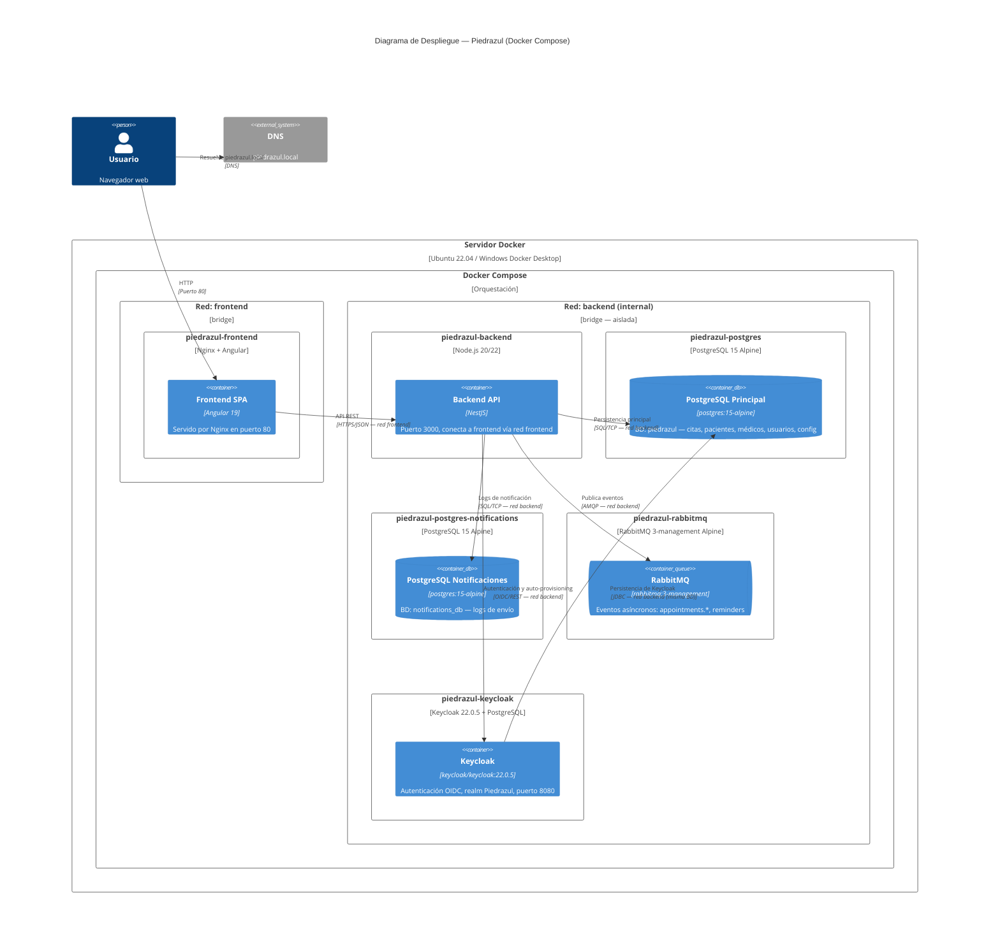

# Diagrama de Despliegue — C4 L4

## Puertos Expuestos

| Servicio | Puerto Host | Puerto Contenedor | Protocolo | Propósito |
|----------|-------------|-------------------|-----------|-----------|
| frontend | `80` | `80` | HTTP | SPA Angular servido por Nginx |
| backend | `3000` | `3000` | HTTP | API REST NestJS |
| keycloak | — | `8080` | HTTP | OIDC (solo interno, sin exponer) |

## Redes

| Red | Driver | Acceso | Servicios |
|-----|--------|--------|-----------|
| `frontend` | bridge | Público | frontend, backend |
| `backend` | bridge (internal) | Privado (solo Docker) | backend, postgres, postgres-notifications, rabbitmq, keycloak |

## Volúmenes Persistente

| Volumen | Montaje | Servicio |
|---------|---------|----------|
| `postgres_data` | `/var/lib/postgresql/data` | postgres |
| `postgres_notifications_data` | `/var/lib/postgresql/data` | postgres-notifications |
| `rabbitmq_data` | `/var/lib/rabbitmq` | rabbitmq |
| `keycloak_data` | `/opt/keycloak/data` | keycloak |

## Recursos Asignados

| Servicio | CPU Límite | Memoria Límite | CPU Reservada | Memoria Reservada |
|----------|-----------|---------------|--------------|------------------|
| backend | 1.0 | 512 MB | 0.25 | 256 MB |
| frontend | 0.5 | 256 MB | 0.1 | 128 MB |
| postgres | 0.5 | 512 MB | 0.1 | 256 MB |
| postgres-notifications | 0.5 | 256 MB | 0.1 | 128 MB |
| rabbitmq | 0.5 | 256 MB | 0.1 | 128 MB |
| keycloak | 1.0 | 1 GB | 0.25 | 512 MB |

## Notas de Despliegue

- **Notification Service** no está incluido en docker-compose.yml actual. Debe agregarse como servicio independiente conectado a la red `backend` y a `postgres-notifications`.
- Keycloak usa la misma instancia PostgreSQL que la aplicación (BD `keycloak`), separada por esquemas/bases de datos lógicas.
- La red `backend` es `internal: true` → no tiene acceso externo, solo entre contenedores Docker.
- Todos los servicios tienen `restart: unless-stopped` para auto-recuperación ante fallos.
- Los healthchecks evitan arrancar servicios dependientes antes de tiempo (ej: backend espera a postgres + rabbitmq + keycloak).
