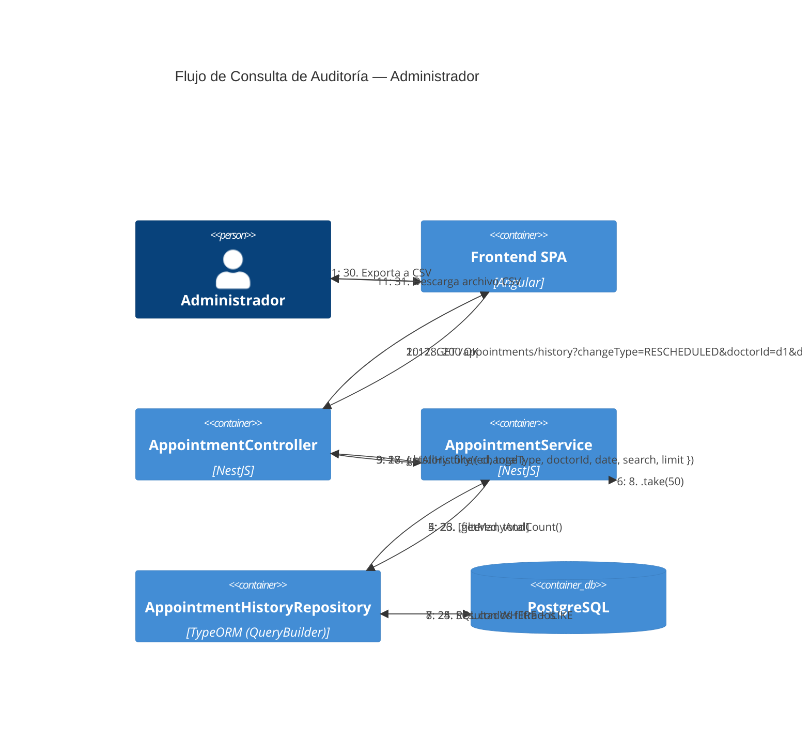

# Flujo de Consulta de Auditoría (Admin)

```mermaid
C4Dynamic
  title Flujo de Consulta de Auditoría — Administrador

  Person(admin, "Administrador")
  Container(spa, "Frontend SPA", "Angular")
  Container(appt_controller, "AppointmentController", "NestJS")
  Container(appt_service, "AppointmentService", "NestJS")
  Container(history_repo, "AppointmentHistoryRepository", "TypeORM (QueryBuilder)")
  ContainerDb(postgres, "PostgreSQL")

  Rel(admin, spa, "1. Navega a /admin/auditoria")
  Rel(spa, appt_controller, "2. GET /appointments/history?limit=50")
  Rel(appt_controller, appt_service, "3. getAllHistory({ limit: 50 })")
  Rel(appt_service, history_repo, "4. createQueryBuilder('h')")
  Rel(history_repo, appt_service, "5. QueryBuilder")
  Rel(appt_service, appt_service, "6. .leftJoinAndSelect('h.appointment', 'a')")
  Rel(appt_service, appt_service, "7. .orderBy('h.changedAt', 'DESC')")
  Rel(appt_service, appt_service, "8. .take(50)")
  Rel(appt_service, history_repo, "9. .getManyAndCount()")
  Rel(history_repo, postgres, "10. SQL query", "TCP")
  Rel(postgres, history_repo, "11. [AppointmentHistory[], total]")
  Rel(history_repo, appt_service, "12. [history, total]")
  Rel(appt_service, appt_controller, "13. { history, total }")
  Rel(appt_controller, spa, "14. 200 OK", "JSON")
  Rel(spa, admin, "15. Renderiza tabla con filtros")

  Rel(admin, spa, "16. Aplica filtros: tipo=médico, fecha, búsqueda")
  Rel(spa, appt_controller, "17. GET /appointments/history?changeType=RESCHEDULED&doctorId=d1&date=2026-05-25&search=Juan")
  Rel(appt_controller, appt_service, "18. getAllHistory({ changeType, doctorId, date, search, limit })")
  Rel(appt_service, history_repo, "19. .andWhere('h.changeType = :changeType')")
  Rel(appt_service, history_repo, "20. .andWhere('a.doctorId = :doctorId')")
  Rel(appt_service, history_repo, "21. .andWhere('DATE(h.changedAt) = :date')")
  Rel(appt_service, history_repo, "22. .andWhere('(h.patientName ILIKE :search OR a.patientDocument ILIKE :search)'")
  Rel(appt_service, history_repo, "23. .getManyAndCount()")
  Rel(history_repo, postgres, "24. SQL con WHERE + ILIKE")
  Rel(postgres, history_repo, "25. Resultados filtrados")
  Rel(history_repo, appt_service, "26. [filtered, total]")
  Rel(appt_service, appt_controller, "27. { history: filtered, total }")
  Rel(appt_controller, spa, "28. 200 OK")
  Rel(spa, admin, "29. Actualiza tabla")

  Rel(admin, spa, "30. Exporta a CSV")
  Rel(spa, admin, "31. Descarga archivo CSV")

  UpdateRelStyle(admin, spa, $offsetX="-50", $offsetY="-10")
```
