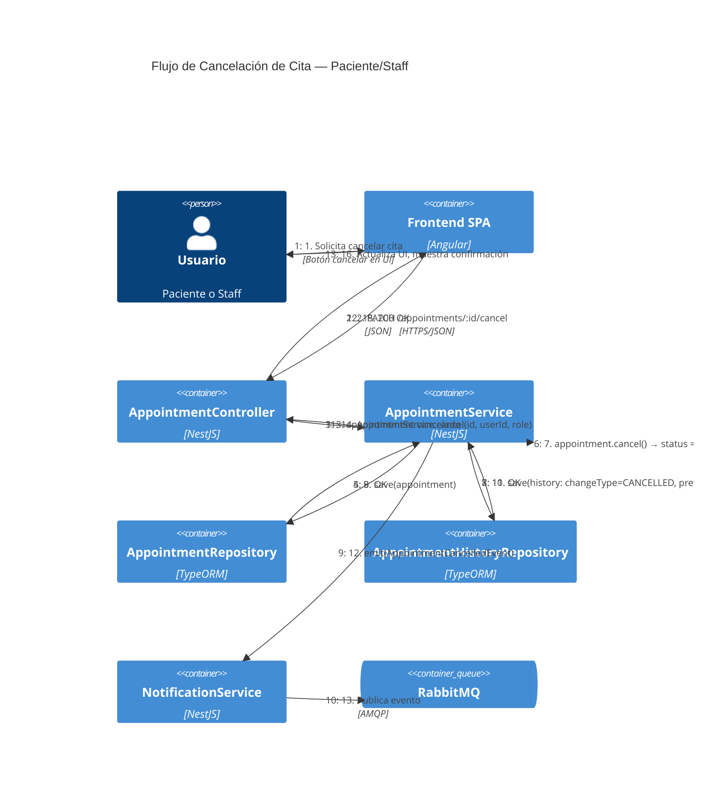

# Flujo de Cancelación de Cita

```mermaid
C4Dynamic
  title Flujo de Cancelación de Cita — Paciente/Staff

  Person(actor, "Usuario", "Paciente o Staff")
  Container(spa, "Frontend SPA", "Angular")
  Container(appt_controller, "AppointmentController", "NestJS")
  Container(appt_service, "AppointmentService", "NestJS")
  Container(appt_repo, "AppointmentRepository", "TypeORM")
  Container(history_repo, "AppointmentHistoryRepository", "TypeORM")
  Container(notif_service, "NotificationService", "NestJS")
  ContainerQueue(rabbitmq, "RabbitMQ")

  Rel(actor, spa, "1. Solicita cancelar cita", "Botón cancelar en UI")
  Rel(spa, appt_controller, "2. PATCH /appointments/:id/cancel", "HTTPS/JSON")
  Rel(appt_controller, appt_service, "3. appointmentService.cancel(id, userId, role)")

  Rel(appt_service, appt_repo, "4. findOne({ where: { id } })")
  Rel(appt_repo, appt_service, "5. Appointment")

  Rel(appt_service, appt_service, "6. Valida: exists → !isCancelled() → !isCompleted() → isInFuture() → isOwnedBy()")

  Rel(appt_service, appt_service, "7. appointment.cancel() → status = CANCELLED")

  Rel(appt_service, appt_repo, "8. save(appointment)")
  Rel(appt_repo, appt_service, "9. OK")

  Rel(appt_service, history_repo, "10. save(history: changeType=CANCELLED, previousStatus, newStatus)")
  Rel(history_repo, appt_service, "11. OK")

  Rel(appt_service, notif_service, "12. emit(AppointmentCancelledEvent)")
  Rel(notif_service, rabbitmq, "13. Publica evento", "AMQP")
  Rel(appt_service, appt_controller, "14. Appointment cancelado")
  Rel(appt_controller, spa, "15. 200 OK", "JSON")
  Rel(spa, actor, "16. Actualiza UI, muestra confirmación")

  UpdateRelStyle(actor, spa, $offsetX="-40", $offsetY="-10")
```
