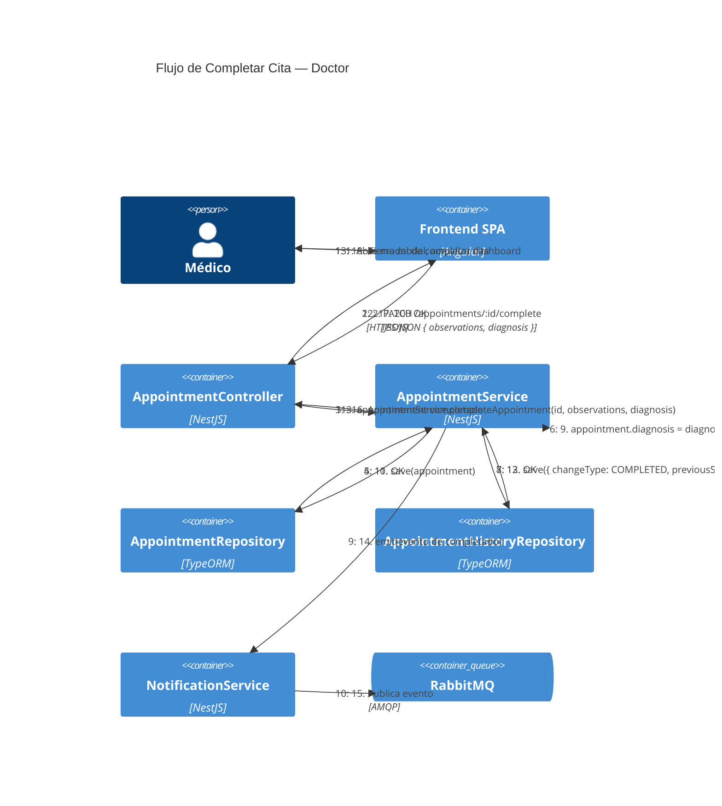

# Flujo de Completar Cita

```mermaid
C4Dynamic
  title Flujo de Completar Cita — Doctor

  Person(doctor, "Médico")
  Container(spa, "Frontend SPA", "Angular")
  Container(appt_controller, "AppointmentController", "NestJS")
  Container(appt_service, "AppointmentService", "NestJS")
  Container(appt_repo, "AppointmentRepository", "TypeORM")
  Container(history_repo, "AppointmentHistoryRepository", "TypeORM")
  Container(notif_service, "NotificationService", "NestJS")
  ContainerQueue(rabbitmq, "RabbitMQ")

  Rel(doctor, spa, "1. Abre modal de completar cita")
  Rel(spa, appt_controller, "2. PATCH /appointments/:id/complete", "HTTPS/JSON { observations, diagnosis }")
  Rel(appt_controller, appt_service, "3. appointmentService.completeAppointment(id, observations, diagnosis)")

  Rel(appt_service, appt_repo, "4. findOne({ where: { id } })")
  Rel(appt_repo, appt_service, "5. Appointment")

  Rel(appt_service, appt_service, "6. isCancelled()? → BadRequestException")

  Rel(appt_service, appt_service, "7. appointment.complete() → status = COMPLETED")
  Rel(appt_service, appt_service, "8. appointment.observations = observations")
  Rel(appt_service, appt_service, "9. appointment.diagnosis = diagnosis")

  Rel(appt_service, appt_repo, "10. save(appointment)")
  Rel(appt_repo, appt_service, "11. OK")

  Rel(appt_service, history_repo, "12. save({ changeType: COMPLETED, previousStatus, newStatus })")
  Rel(history_repo, appt_service, "13. OK")

  Rel(appt_service, notif_service, "14. emit(evento de completado)")
  Rel(notif_service, rabbitmq, "15. Publica evento", "AMQP")
  Rel(appt_service, appt_controller, "16. Appointment completado")
  Rel(appt_controller, spa, "17. 200 OK", "JSON")
  Rel(spa, doctor, "18. Cierra modal, actualiza dashboard")
```
