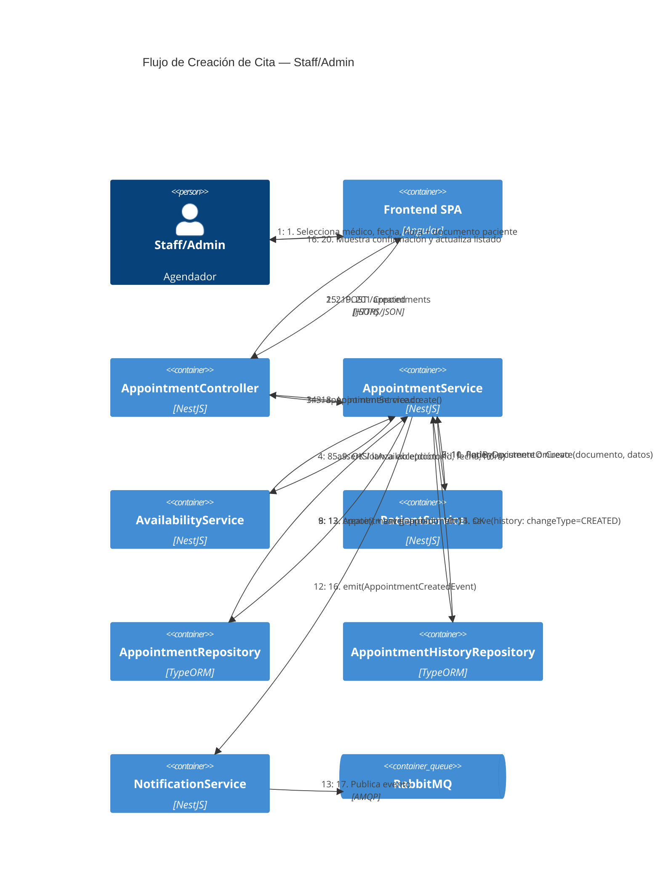

# Flujo de Creación de Cita (Staff)

```mermaid
C4Dynamic
  title Flujo de Creación de Cita — Staff/Admin

  Person(staff, "Staff/Admin", "Agendador")
  Container(spa, "Frontend SPA", "Angular")
  Container(appt_controller, "AppointmentController", "NestJS")
  Container(appt_service, "AppointmentService", "NestJS")
  Container(avail_service, "AvailabilityService", "NestJS")
  Container(patient_service, "PatientService", "NestJS")
  Container(appt_repo, "AppointmentRepository", "TypeORM")
  Container(history_repo, "AppointmentHistoryRepository", "TypeORM")
  Container(notif_service, "NotificationService", "NestJS")
  ContainerQueue(rabbitmq, "RabbitMQ")

  Rel(staff, spa, "1. Selecciona médico, fecha, hora + documento paciente")
  Rel(spa, appt_controller, "2. POST /appointments", "HTTPS/JSON")
  Rel(appt_controller, appt_service, "3. appointmentService.create()")

  Rel(appt_service, avail_service, "4. validateTimeWindow(fecha, hora)")
  Rel(avail_service, appt_service, "5. OK / lanza excepción")

  Rel(appt_service, avail_service, "6. validateDoctorException(doctorId, fecha)")
  Rel(avail_service, appt_service, "7. OK / lanza excepción")

  Rel(appt_service, avail_service, "8. assertSlotAvailable(doctorId, fecha, hora)")
  Rel(avail_service, appt_service, "9. OK / lanza excepción")

  Rel(appt_service, patient_service, "10. findByDocumentOrCreate(documento, datos)")
  Rel(patient_service, appt_service, "11. Patient existente o nuevo")

  Rel(appt_service, appt_repo, "12. create() + save(appointment)")
  Rel(appt_repo, appt_service, "13. Appointment guardado")

  Rel(appt_service, history_repo, "14. save(history: changeType=CREATED)")
  Rel(history_repo, appt_service, "15. OK")

  Rel(appt_service, notif_service, "16. emit(AppointmentCreatedEvent)")
  Rel(notif_service, rabbitmq, "17. Publica evento", "AMQP")
  Rel(appt_service, appt_controller, "18. Appointment creado")
  Rel(appt_controller, spa, "19. 201 Created", "JSON")
  Rel(spa, staff, "20. Muestra confirmación y actualiza listado")

  UpdateRelStyle(staff, spa, $offsetX="-40", $offsetY="-10")
  UpdateRelStyle(appt_service, avail_service, $offsetX="-20")
  UpdateRelStyle(notif_service, rabbitmq, $offsetX="20", $offsetY="-10")
```
