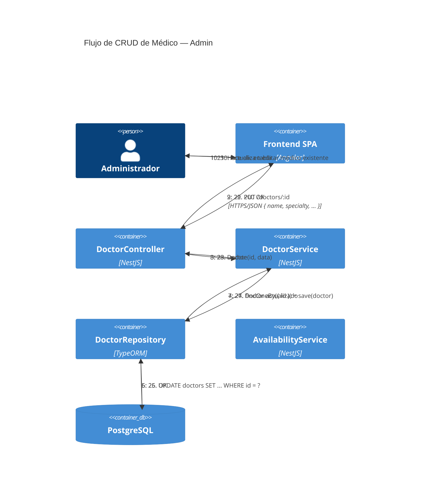

# Flujo de Creación/Edición de Médico

```mermaid
C4Dynamic
  title Flujo de CRUD de Médico — Admin

  Person(admin, "Administrador")
  Container(spa, "Frontend SPA", "Angular")
  Container(doc_controller, "DoctorController", "NestJS")
  Container(doc_service, "DoctorService", "NestJS")
  Container(doc_repo, "DoctorRepository", "TypeORM")
  Container(avail_service, "AvailabilityService", "NestJS")
  ContainerDb(postgres, "PostgreSQL")

  Rel(admin, spa, "1. Navega a módulo de médicos")
  Rel(spa, doc_controller, "2. GET /doctors")
  Rel(doc_controller, doc_service, "3. findAll()")
  Rel(doc_service, doc_repo, "4. find()")
  Rel(doc_repo, postgres, "5. SELECT * FROM doctors")
  Rel(postgres, doc_repo, "6. Doctor[]")
  Rel(doc_repo, doc_service, "7. Lista de médicos")
  Rel(doc_service, doc_controller, "8. Doctor[]")
  Rel(doc_controller, spa, "9. 200 OK", "JSON")
  Rel(spa, admin, "10. Renderiza tabla de médicos")

  Rel(admin, spa, "11. Hace clic en 'Nuevo médico' y completa formulario")
  Rel(spa, doc_controller, "12. POST /doctors", "HTTPS/JSON { name, specialty, scheduleStart, scheduleEnd, slotDuration, activeDays }")
  Rel(doc_controller, doc_service, "13. create(data)")
  Rel(doc_service, doc_repo, "14. create(data) + save(doctor)")
  Rel(doc_repo, postgres, "15. INSERT INTO doctors")
  Rel(postgres, doc_repo, "16. Doctor creado")
  Rel(doc_repo, doc_service, "17. Doctor")
  Rel(doc_service, doc_controller, "18. Doctor creado")
  Rel(doc_controller, spa, "19. 201 Created", "JSON")
  Rel(spa, admin, "20. Actualiza tabla, muestra éxito")

  Rel(admin, spa, "21. Hace clic en editar médico existente")
  Rel(spa, doc_controller, "22. PUT /doctors/:id", "HTTPS/JSON { name, specialty, ... }")
  Rel(doc_controller, doc_service, "23. update(id, data)")
  Rel(doc_service, doc_repo, "24. findOneBy({ id }) + save(doctor)")
  Rel(doc_repo, postgres, "25. UPDATE doctors SET ... WHERE id = ?")
  Rel(postgres, doc_repo, "26. OK")
  Rel(doc_repo, doc_service, "27. Doctor actualizado")
  Rel(doc_service, doc_controller, "28. Doctor")
  Rel(doc_controller, spa, "29. 200 OK")
  Rel(spa, admin, "30. Actualiza tabla")
```
