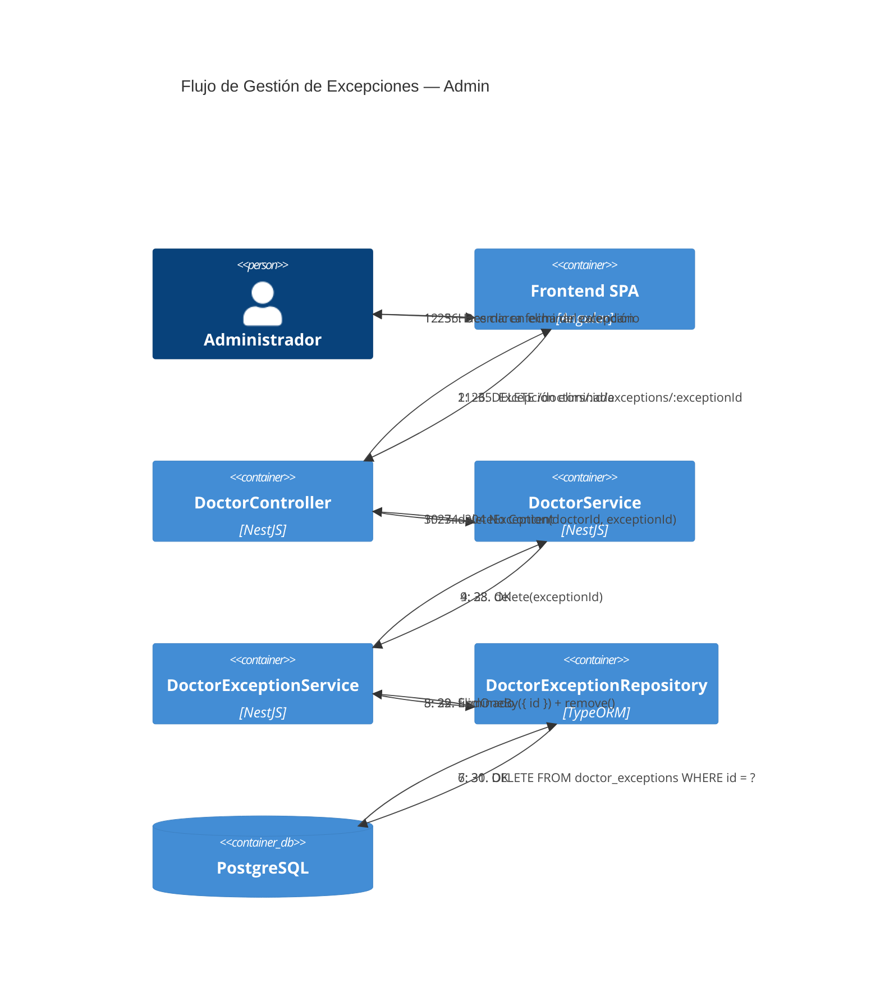

# Flujo de Gestión de Excepciones de Médico

```mermaid
C4Dynamic
  title Flujo de Gestión de Excepciones — Admin

  Person(admin, "Administrador")
  Container(spa, "Frontend SPA", "Angular")
  Container(doc_controller, "DoctorController", "NestJS")
  Container(doc_service, "DoctorService", "NestJS")
  Container(exc_service, "DoctorExceptionService", "NestJS")
  Container(exc_repo, "DoctorExceptionRepository", "TypeORM")
  ContainerDb(postgres, "PostgreSQL")

  Rel(admin, spa, "1. Selecciona un médico y va a 'Excepciones'")
  Rel(spa, doc_controller, "2. GET /doctors/:id/exceptions")
  Rel(doc_controller, doc_service, "3. getExceptions(doctorId)")
  Rel(doc_service, exc_service, "4. findByDoctor(doctorId)")
  Rel(exc_service, exc_repo, "5. find({ where: { doctor: { id } } })")
  Rel(exc_repo, postgres, "6. SELECT * FROM doctor_exceptions WHERE doctor_id = ?")
  Rel(postgres, exc_repo, "7. DoctorException[]")
  Rel(exc_repo, exc_service, "8. Excepciones del médico")
  Rel(exc_service, doc_service, "9. DoctorException[]")
  Rel(doc_service, doc_controller, "10. Lista de excepciones")
  Rel(doc_controller, spa, "11. 200 OK", "JSON")
  Rel(spa, admin, "12. Renderiza calendario con excepciones marcadas")

  Rel(admin, spa, "13. Selecciona una fecha y agrega excepción con motivo")
  Rel(spa, doc_controller, "14. POST /doctors/:id/exceptions", "HTTPS/JSON { date, reason }")
  Rel(doc_controller, doc_service, "15. createException(doctorId, dto)")
  Rel(doc_service, exc_service, "16. create(doctorId, { date, reason })")
  Rel(exc_service, exc_repo, "17. create({ doctor, date, reason }) + save()")
  Rel(exc_repo, postgres, "18. INSERT INTO doctor_exceptions")
  Rel(postgres, exc_repo, "19. OK")
  Rel(exc_repo, exc_service, "20. DoctorException")
  Rel(exc_service, doc_service, "21. Excepción creada")
  Rel(doc_service, doc_controller, "22. DoctorException")
  Rel(doc_controller, spa, "23. 201 Created")
  Rel(spa, admin, "24. Marca fecha en calendario como bloqueada")

  Rel(admin, spa, "25. Hace clic en eliminar excepción")
  Rel(spa, doc_controller, "26. DELETE /doctors/:id/exceptions/:exceptionId")
  Rel(doc_controller, doc_service, "27. deleteException(doctorId, exceptionId)")
  Rel(doc_service, exc_service, "28. delete(exceptionId)")
  Rel(exc_service, exc_repo, "29. findOneBy({ id }) + remove()")
  Rel(exc_repo, postgres, "30. DELETE FROM doctor_exceptions WHERE id = ?")
  Rel(postgres, exc_repo, "31. OK")
  Rel(exc_repo, exc_service, "32. Eliminado")
  Rel(exc_service, doc_service, "33. OK")
  Rel(doc_service, doc_controller, "34. 204 No Content")
  Rel(doc_controller, spa, "35. Excepción eliminada")
  Rel(spa, admin, "36. Desmarca fecha del calendario")
```
