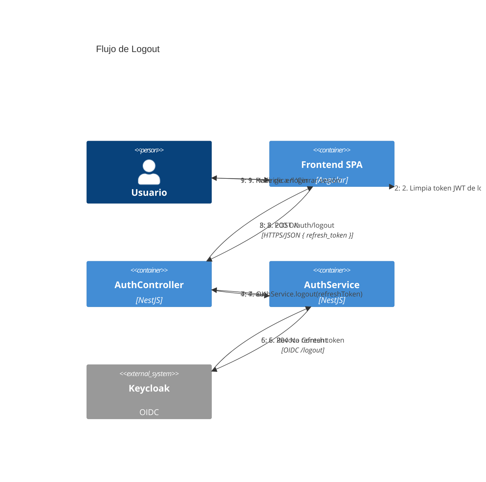

# Flujo de Cierre de Sesión

```mermaid
C4Dynamic
  title Flujo de Logout

  Person(user, "Usuario")
  Container(spa, "Frontend SPA", "Angular")
  Container(auth_controller, "AuthController", "NestJS")
  Container(auth_service, "AuthService", "NestJS")
  System_Ext(keycloak, "Keycloak", "OIDC")

  Rel(user, spa, "1. Hace clic en 'Cerrar sesión'")
  Rel(spa, spa, "2. Limpia token JWT de localStorage")
  Rel(spa, auth_controller, "3. POST /auth/logout", "HTTPS/JSON { refresh_token }")
  Rel(auth_controller, auth_service, "4. authService.logout(refreshToken)")
  Rel(auth_service, keycloak, "5. Revoca refresh token", "OIDC /logout")
  Rel(keycloak, auth_service, "6. 204 No Content")
  Rel(auth_service, auth_controller, "7. OK")
  Rel(auth_controller, spa, "8. 200 OK")
  Rel(spa, user, "9. Redirige a /login")
```
