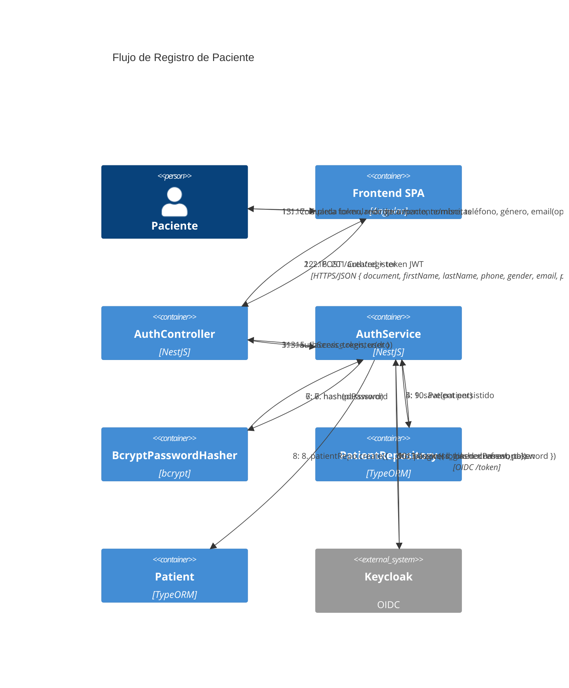

# Flujo de Registro de Paciente

```mermaid
C4Dynamic
  title Flujo de Registro de Paciente

  Person(patient, "Paciente")
  Container(spa, "Frontend SPA", "Angular")
  Container(auth_controller, "AuthController", "NestJS")
  Container(auth_service, "AuthService", "NestJS")
  Container(password_hasher, "BcryptPasswordHasher", "bcrypt")
  Container(patient_repo, "PatientRepository", "TypeORM")
  Container(patient_entity, "Patient", "TypeORM")
  System_Ext(keycloak, "Keycloak", "OIDC")

  Rel(patient, spa, "1. Completa formulario: documento, nombre, teléfono, género, email(opcional), password")
  Rel(spa, auth_controller, "2. POST /auth/register", "HTTPS/JSON { document, firstName, lastName, phone, gender, email, password }")
  Rel(auth_controller, auth_service, "3. authService.register(dto)")

  Rel(auth_service, patient_repo, "4. findOneBy({ document }) — verifica duplicado")
  Rel(patient_repo, auth_service, "5. null (no existe)")

  Rel(auth_service, password_hasher, "6. hash(password)")
  Rel(password_hasher, auth_service, "7. hashedPassword")

  Rel(auth_service, patient_entity, "8. patientRepo.create({ ...dto, password: hashedPassword })")
  Rel(auth_service, patient_repo, "9. save(patient)")
  Rel(patient_repo, auth_service, "10. Patient persistido")

  Rel(auth_service, keycloak, "11. createUser({ username: document, firstName, lastName, email, password })", "REST /admin/realms/.../users")
  Rel(keycloak, auth_service, "12. 201 Created (o error con advertencia)")

  Rel(auth_service, keycloak, "13. login({ login: document, password })", "OIDC /token")
  Rel(keycloak, auth_service, "14. access_token + refresh_token")

  Rel(auth_service, auth_controller, "15. { access_token, user }")
  Rel(auth_controller, spa, "16. 201 Created + token JWT")
  Rel(spa, patient, "17. Guarda token, redirige a /paciente/miscitas")
```
