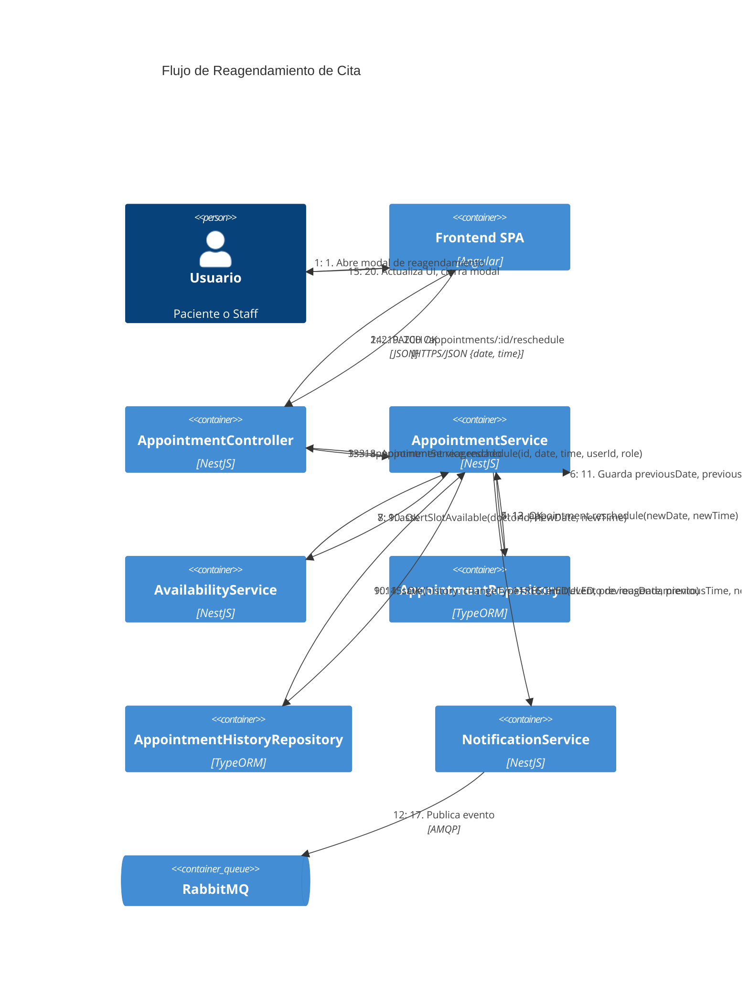

# Flujo de Reagendamiento de Cita

```mermaid
C4Dynamic
  title Flujo de Reagendamiento de Cita

  Person(actor, "Usuario", "Paciente o Staff")
  Container(spa, "Frontend SPA", "Angular")
  Container(appt_controller, "AppointmentController", "NestJS")
  Container(appt_service, "AppointmentService", "NestJS")
  Container(avail_service, "AvailabilityService", "NestJS")
  Container(appt_repo, "AppointmentRepository", "TypeORM")
  Container(history_repo, "AppointmentHistoryRepository", "TypeORM")
  Container(notif_service, "NotificationService", "NestJS")
  ContainerQueue(rabbitmq, "RabbitMQ")

  Rel(actor, spa, "1. Abre modal de reagendamiento")
  Rel(spa, appt_controller, "2. PATCH /appointments/:id/reschedule", "HTTPS/JSON {date, time}")
  Rel(appt_controller, appt_service, "3. appointmentService.reschedule(id, date, time, userId, role)")

  Rel(appt_service, appt_repo, "4. findOne({ where: { id }, relations: [patient, doctor] })")
  Rel(appt_repo, appt_service, "5. Appointment con doctor y patient")

  Rel(appt_service, appt_service, "6. Valida: exists → canBeRescheduled() → isOwnedBy()")

  Rel(appt_service, avail_service, "7. validateTimeWindow(newDate, newTime)")
  Rel(avail_service, appt_service, "8. OK")

  Rel(appt_service, avail_service, "9. assertSlotAvailable(doctorId, newDate, newTime)")
  Rel(avail_service, appt_service, "10. OK")

  Rel(appt_service, appt_service, "11. Guarda previousDate, previousTime para historial")

  Rel(appt_service, appt_repo, "12. appointment.reschedule(newDate, newTime) → save()")
  Rel(appt_repo, appt_service, "13. OK")

  Rel(appt_service, history_repo, "14. save(history: changeType=RESCHEDULED, previousDate, previousTime, newDate, newTime)")
  Rel(history_repo, appt_service, "15. OK")

  Rel(appt_service, notif_service, "16. emit(evento de reagendamiento)")
  Rel(notif_service, rabbitmq, "17. Publica evento", "AMQP")
  Rel(appt_service, appt_controller, "18. Appointment reagendado")
  Rel(appt_controller, spa, "19. 200 OK", "JSON")
  Rel(spa, actor, "20. Actualiza UI, cierra modal")

  UpdateRelStyle(actor, spa, $offsetX="-40", $offsetY="-10")
```
