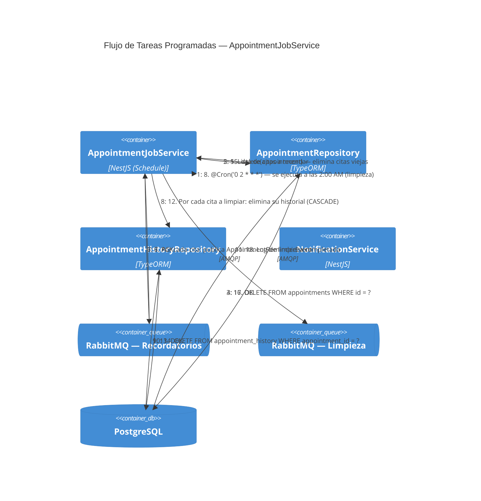

# Flujo de Tareas Programadas

```mermaid
C4Dynamic
  title Flujo de Tareas Programadas — AppointmentJobService

  Container(job_service, "AppointmentJobService", "NestJS (Schedule)")
  Container(appt_repo, "AppointmentRepository", "TypeORM")
  Container(history_repo, "AppointmentHistoryRepository", "TypeORM")
  Container(notif_service, "NotificationService", "NestJS")
  ContainerQueue(rabbitmq_reminder, "RabbitMQ — Recordatorios")
  ContainerQueue(rabbitmq_cleanup, "RabbitMQ — Limpieza")
  ContainerDb(postgres, "PostgreSQL")

  Rel(job_service, job_service, "1. @Cron('0 8 * * *') — se ejecuta a las 8:00 AM")

  Rel(job_service, appt_repo, "2. findTomorrowAppointments() → citas con fecha = tomorrow + status = CONFIRMED")
  Rel(appt_repo, postgres, "3. SELECT ... WHERE appointment_date = tomorrow AND status = 'confirmada'")
  Rel(postgres, appt_repo, "4. Appointment[] (confirmadas de mañana)")
  Rel(appt_repo, job_service, "5. Lista de citas a recordar")

  Rel(job_service, rabbitmq_reminder, "6. Por cada cita: publica AppointmentReminderEvent", "AMQP")
  Rel(rabbitmq_reminder, job_service, "7. ACK")

  Rel(job_service, job_service, "8. @Cron('0 2 * * *') — se ejecuta a las 2:00 AM (limpieza)")

  Rel(job_service, appt_repo, "9. findOldAppointments(days=30) → citas completadas/canceladas > 30 días")
  Rel(appt_repo, postgres, "10. SELECT ... WHERE updated_at < now() - interval '30 days' AND status IN ('completada','cancelada')")
  Rel(postgres, appt_repo, "11. Appointment[] viejas")

  Rel(job_service, history_repo, "12. Por cada cita a limpiar: elimina su historial (CASCADE)")
  Rel(history_repo, postgres, "13. DELETE FROM appointment_history WHERE appointment_id = ?")
  Rel(postgres, history_repo, "14. OK")

  Rel(job_service, appt_repo, "15. delete(appointment) — elimina citas viejas")
  Rel(appt_repo, postgres, "16. DELETE FROM appointments WHERE id = ?")
  Rel(postgres, appt_repo, "17. OK")

  Rel(job_service, rabbitmq_cleanup, "18. Log de limpieza completada", "AMQP")
```
