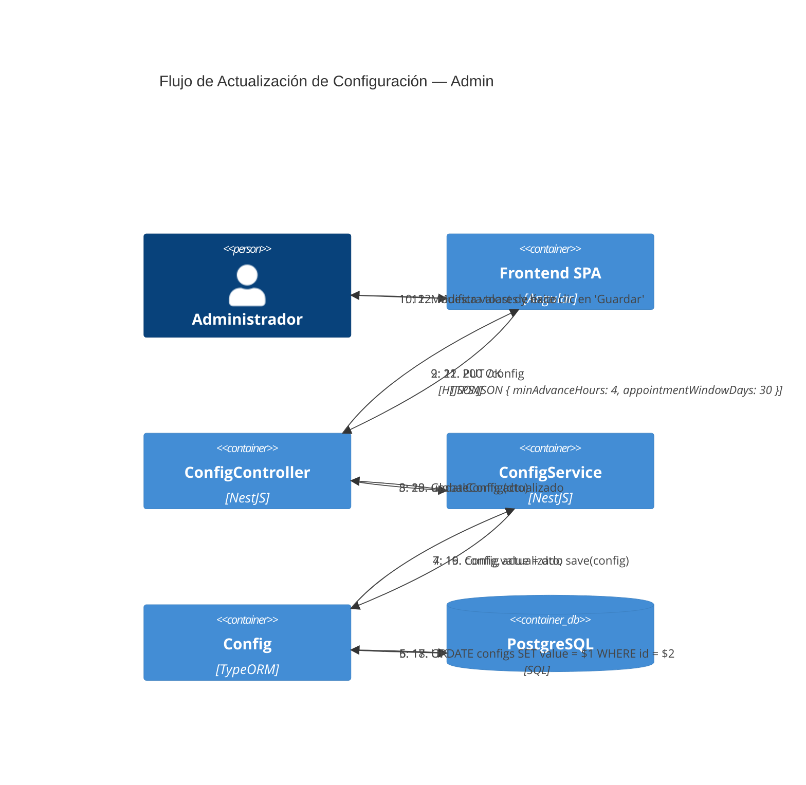

# Flujo de Actualización de Configuración

```mermaid
C4Dynamic
  title Flujo de Actualización de Configuración — Admin

  Person(admin, "Administrador")
  Container(spa, "Frontend SPA", "Angular")
  Container(cfg_controller, "ConfigController", "NestJS")
  Container(cfg_service, "ConfigService", "NestJS")
  Container(cfg_entity, "Config", "TypeORM")
  ContainerDb(postgres, "PostgreSQL")

  Rel(admin, spa, "1. Navega a /admin/configuracion")
  Rel(spa, cfg_controller, "2. GET /config")
  Rel(cfg_controller, cfg_service, "3. getConfig()")
  Rel(cfg_service, cfg_entity, "4. findOneBy({ key: 'global' })")
  Rel(cfg_entity, postgres, "5. SELECT * FROM configs WHERE key = 'global'")
  Rel(postgres, cfg_entity, "6. Config { key: 'global', value: { minAdvanceHours: 2, appointmentWindowDays: 15 } }")
  Rel(cfg_entity, cfg_service, "7. GlobalConfig")
  Rel(cfg_service, cfg_controller, "8. GlobalConfig")
  Rel(cfg_controller, spa, "9. 200 OK", "JSON")
  Rel(spa, admin, "10. Renderiza formulario con valores actuales")

  Rel(admin, spa, "11. Modifica valores y hace clic en 'Guardar'")
  Rel(spa, cfg_controller, "12. PUT /config", "HTTPS/JSON { minAdvanceHours: 4, appointmentWindowDays: 30 }")
  Rel(cfg_controller, cfg_service, "13. updateConfig(dto)")
  Rel(cfg_service, cfg_entity, "14. findOneBy({ key: 'global' })")
  Rel(cfg_entity, cfg_service, "15. Config existente")
  Rel(cfg_service, cfg_entity, "16. config.value = dto; save(config)")
  Rel(cfg_entity, postgres, "17. UPDATE configs SET value = $1 WHERE id = $2", "SQL")
  Rel(postgres, cfg_entity, "18. OK")
  Rel(cfg_entity, cfg_service, "19. Config actualizado")
  Rel(cfg_service, cfg_controller, "20. GlobalConfig actualizado")
  Rel(cfg_controller, spa, "21. 200 OK", "JSON")
  Rel(spa, admin, "22. Muestra toast de éxito")
```
