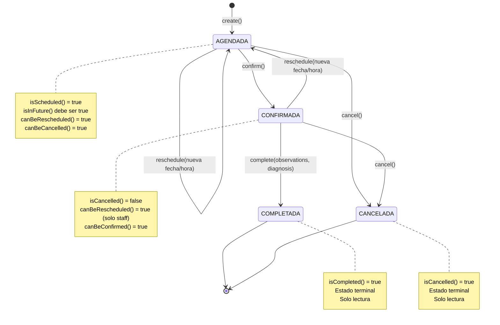

# Diagrama de Estados — Appointment (Cita Médica)

## Transiciones y Validaciones

| Desde | Hasta | Método | Validaciones | Actor |
|-------|-------|--------|-------------|-------|
| `[*]` | `AGENDADA` | `create()` | Slot disponible, ventana de tiempo, sin excepción | Staff/Admin/Paciente |
| `AGENDADA` | `CONFIRMADA` | `confirm()` | `canBeConfirmed()` → `!isCancelled()` | Staff/Doctor |
| `AGENDADA` | `CANCELADA` | `cancel()` | `canBeCancelled()` → `!isCancelled() && !isCompleted() && isInFuture()` | Staff/Paciente (dueño) |
| `AGENDADA` | `AGENDADA` | `reschedule()` | `canBeRescheduled()` → `isScheduled()`, nuevo slot válido | Staff/Paciente (dueño) |
| `CONFIRMADA` | `COMPLETADA` | `complete()` | `!isCancelled()`, requiere observaciones/diagnóstico opcional | Doctor |
| `CONFIRMADA` | `CANCELADA` | `cancel()` | `canBeCancelled()` | Staff/Doctor |
| `CONFIRMADA` | `AGENDADA` | `reschedule()` | `canBeRescheduled()` → `isScheduled() \|\| status === CONFIRMED` | Staff |

## Reglas de Dominio

- **`isInFuture()`**: compara `appointmentDate + appointmentTime` con `new Date()`
- **`isOwnedBy(patientId)`**: el paciente es dueño de la cita si `patient.id === patientId`
- **`belongsToDoctor(doctorId)`**: el doctor es el asignado si `doctor.id === doctorId`
- **Auditoría**: cada transición genera un registro en `AppointmentHistory` con `changeType`, valores anteriores y nuevos, `changedBy` y `changedByRole`
- **Notificaciones**: las transiciones `CREATED`, `CANCELLED`, `RESCHEDULED`, `CONFIRMED` publican eventos a RabbitMQ
