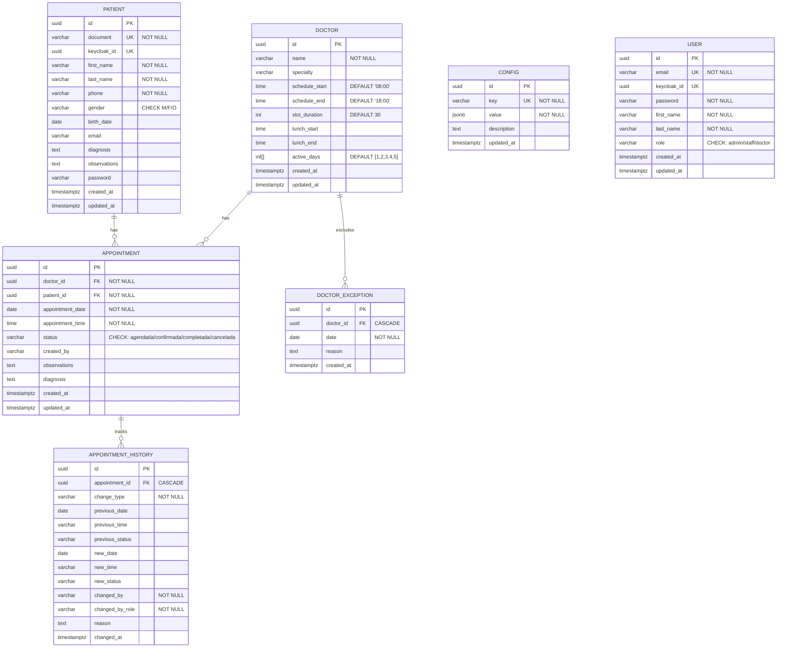

# Diagrama de Base de Datos — Piedrazul

## Esquema ER

## Índices

| Tabla | Índice | Tipo | Columnas |
|-------|--------|------|----------|
| `appointments` | `IDX_appointment_doctor_date_time` | UNIQUE B-tree | `doctor_id`, `appointment_date`, `appointment_time` |
| `appointments` | `IDX_appointment_doctor` | B-tree | `doctor_id` |
| `appointments` | `IDX_appointment_patient` | B-tree | `patient_id` |
| `appointments` | `IDX_appointment_date` | B-tree | `appointment_date` |
| `appointment_history` | `IDX_history_appointment` | B-tree | `appointment_id` |
| `doctor_exceptions` | `IDX_exception_doctor` | B-tree | `doctor_id` |
| `doctors` | `IDX_doctor_active_days` | GIN | `active_days` |
| `patients` | `IDX_patient_document` | UNIQUE B-tree | `document` |
| `patients` | `IDX_patient_keycloak` | UNIQUE B-tree | `keycloak_id` |
| `configs` | `IDX_config_key` | UNIQUE B-tree | `key` |
| `configs` | `IDX_config_value` | GIN | `value` |
| `users` | `IDX_user_email` | UNIQUE B-tree | `email` |
| `users` | `IDX_user_keycloak` | UNIQUE B-tree | `keycloak_id` |

## Constraints

- `appointments.status` → `CHECK (status IN ('agendada','confirmada','completada','cancelada'))`
- `patients.gender` → `CHECK (gender IN ('M','F','O'))`
- `patients.email` → `CHECK (email IS NULL OR email ~* '^[^@]+@[^@]+$')`
- `users.role` → `CHECK (role IN ('admin','staff','doctor'))`
- `appointment_history.change_type` → `CHECK (LENGTH(change_type) <= 30)`
- `configs.value` → `CHECK (jsonb_typeof(value) = 'object')`

## Relaciones

- `Appointment.doctor` → `Doctor.id` (OBLIGATORIO, una cita tiene un médico)
- `Appointment.patient` → `Patient.id` (OBLIGATORIO, una cita tiene un paciente)
- `AppointmentHistory.appointment` → `Appointment.id` (CASCADE, historial se elimina con la cita)
- `DoctorException.doctor` → `Doctor.id` (CASCADE, excepción se elimina con el médico)

## Notas

- `User` es para staff/admin/doctor que inician sesión con email+password
- `Patient` es para pacientes que se registran con documento
- `Config` almacena configuración global en JSONB (minAdvanceHours, appointmentWindowDays)
- `Doctor.active_days` es un array de enteros (1=lunes…7=domingo) indexado con GIN
- `DoctorException` permite bloquear días específicos por médico (vacaciones, capacitación)
- `AppointmentHistory` es un log de auditoría inmutable con todos los cambios de estado
