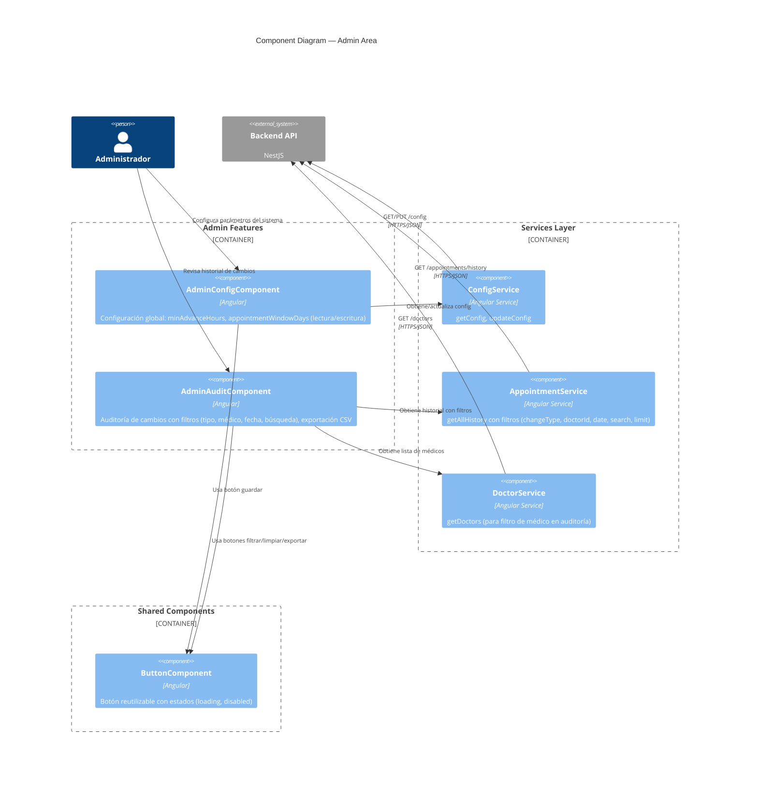

# Frontend — Diagrama de Componentes: Área de Administración

```mermaid
C4Component
  title Component Diagram — Admin Area

  Person(admin, "Administrador")

  System_Ext(backend, "Backend API", "NestJS")

  Container_Boundary(admin_features, "Admin Features") {
    Component(config, "AdminConfigComponent", "Angular", "Configuración global: minAdvanceHours, appointmentWindowDays (lectura/escritura)")
    Component(audit, "AdminAuditComponent", "Angular", "Auditoría de cambios con filtros (tipo, médico, fecha, búsqueda), exportación CSV")
  }

  Container_Boundary(services, "Services Layer") {
    Component(config_svc, "ConfigService", "Angular Service", "getConfig, updateConfig")
    Component(appt_svc, "AppointmentService", "Angular Service", "getAllHistory con filtros (changeType, doctorId, date, search, limit)")
    Component(doc_svc, "DoctorService", "Angular Service", "getDoctors (para filtro de médico en auditoría)")
  }

  Container_Boundary(shared, "Shared Components") {
    Component(btn, "ButtonComponent", "Angular", "Botón reutilizable con estados (loading, disabled)")
  }

  Rel(admin, config, "Configura parámetros del sistema")
  Rel(admin, audit, "Revisa historial de cambios")

  Rel(config, config_svc, "Obtiene/actualiza config")
  Rel(audit, appt_svc, "Obtiene historial con filtros")
  Rel(audit, doc_svc, "Obtiene lista de médicos")
  Rel(config, btn, "Usa botón guardar")
  Rel(audit, btn, "Usa botones filtrar/limpiar/exportar")

  Rel(config_svc, backend, "GET/PUT /config", "HTTPS/JSON")
  Rel(appt_svc, backend, "GET /appointments/history", "HTTPS/JSON")
  Rel(doc_svc, backend, "GET /doctors", "HTTPS/JSON")
```
