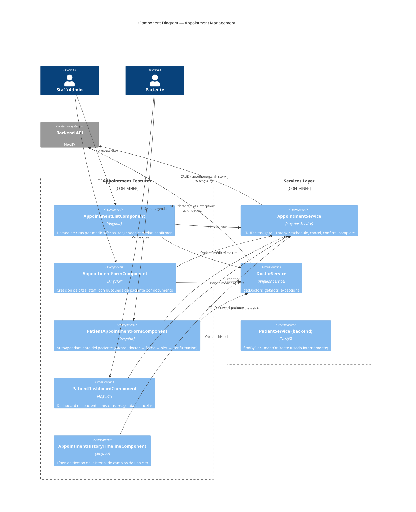

# Frontend — Diagrama de Componentes: Gestión de Citas

```mermaid
C4Component
  title Component Diagram — Appointment Management

  Person(staff, "Staff/Admin")
  Person(patient, "Paciente")

  System_Ext(backend, "Backend API", "NestJS")

  Container_Boundary(appointment_features, "Appointment Features") {
    Component(appointment_list, "AppointmentListComponent", "Angular", "Listado de citas por médico/fecha, reagendar, cancelar, confirmar")
    Component(appointment_form, "AppointmentFormComponent", "Angular", "Creación de citas (staff) con búsqueda de paciente por documento")
    Component(patient_form, "PatientAppointmentFormComponent", "Angular", "Autoagendamiento del paciente (wizard: doctor → fecha → slot → confirmación)")
    Component(patient_dashboard, "PatientDashboardComponent", "Angular", "Dashboard del paciente: mis citas, reagendar, cancelar")
    Component(history_timeline, "AppointmentHistoryTimelineComponent", "Angular", "Línea de tiempo del historial de cambios de una cita")
  }

  Container_Boundary(services, "Services Layer") {
    Component(appt_service, "AppointmentService", "Angular Service", "CRUD citas, getAllHistory, reschedule, cancel, confirm, complete")
    Component(doc_service, "DoctorService", "Angular Service", "getDoctors, getSlots, exceptions")
    Component(patient_svc, "PatientService (backend)", "NestJS", "findByDocumentOrCreate (usado internamente)")
  }

  Rel(staff, appointment_list, "Gestiona citas")
  Rel(staff, appointment_form, "Crea citas")
  Rel(patient, patient_form, "Se autoagenda")
  Rel(patient, patient_dashboard, "Ve sus citas")

  Rel(appointment_list, appt_service, "Obtiene citas")
  Rel(appointment_list, doc_service, "Obtiene médicos")
  Rel(appointment_form, appt_service, "Crea cita")
  Rel(appointment_form, doc_service, "Obtiene médicos y slots")
  Rel(patient_form, appt_service, "Crea cita")
  Rel(patient_form, doc_service, "Obtiene médicos y slots")
  Rel(patient_dashboard, appt_service, "CRUD citas del paciente")
  Rel(history_timeline, appt_service, "Obtiene historial")

  Rel(appt_service, backend, "CRUD /appointments, /history", "HTTPS/JSON")
  Rel(doc_service, backend, "GET /doctors, slots, exceptions", "HTTPS/JSON")
```
