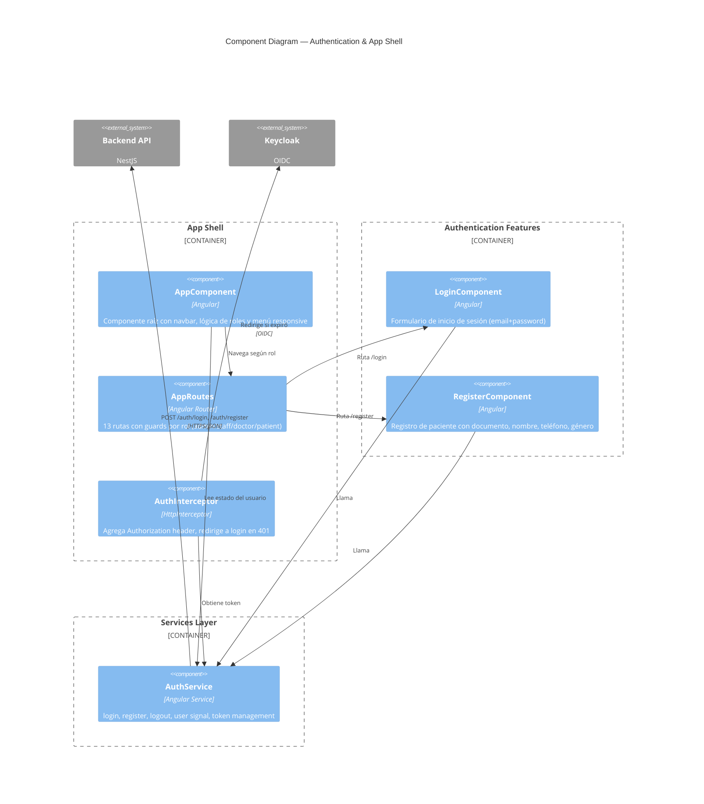

# Frontend — Diagrama de Componentes: Autenticación y Shell

```mermaid
C4Component
  title Component Diagram — Authentication & App Shell

  System_Ext(backend, "Backend API", "NestJS")
  System_Ext(keycloak, "Keycloak", "OIDC")

  Container_Boundary(shell, "App Shell") {
    Component(app_component, "AppComponent", "Angular", "Componente raíz con navbar, lógica de roles y menú responsive")
    Component(app_routes, "AppRoutes", "Angular Router", "13 rutas con guards por rol (admin/staff/doctor/patient)")
    Component(auth_interceptor, "AuthInterceptor", "HttpInterceptor", "Agrega Authorization header, redirige a login en 401")
  }

  Container_Boundary(auth_features, "Authentication Features") {
    Component(login, "LoginComponent", "Angular", "Formulario de inicio de sesión (email+password)")
    Component(register, "RegisterComponent", "Angular", "Registro de paciente con documento, nombre, teléfono, género")
  }

  Container_Boundary(services, "Services Layer") {
    Component(auth_service, "AuthService", "Angular Service", "login, register, logout, user signal, token management")
  }

  Rel(login, auth_service, "Llama")
  Rel(register, auth_service, "Llama")
  Rel(app_component, auth_service, "Lee estado del usuario")
  Rel(auth_service, backend, "POST /auth/login, /auth/register", "HTTPS/JSON")
  Rel(app_component, app_routes, "Navega según rol")
  Rel(app_routes, login, "Ruta /login")
  Rel(app_routes, register, "Ruta /register")
  Rel(auth_interceptor, auth_service, "Obtiene token")
  Rel(auth_interceptor, keycloak, "Redirige si expiró", "OIDC")
```
