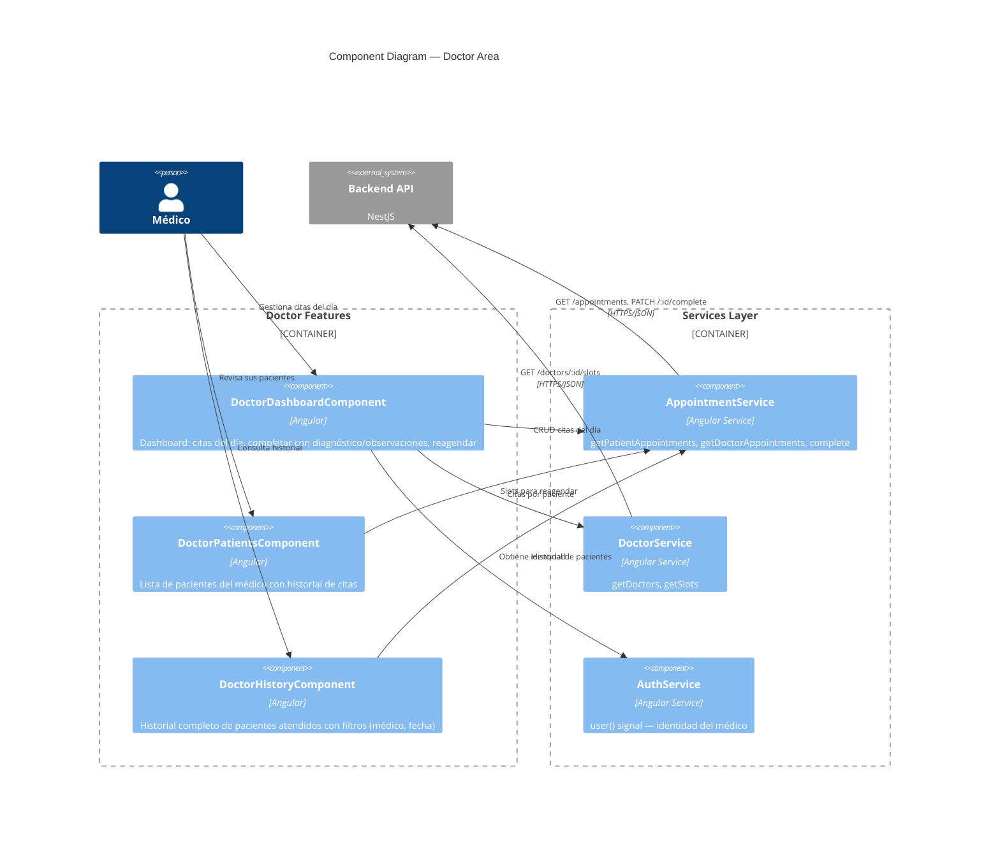

# Frontend — Diagrama de Componentes: Área del Médico

```mermaid
C4Component
  title Component Diagram — Doctor Area

  Person(doctor, "Médico")

  System_Ext(backend, "Backend API", "NestJS")

  Container_Boundary(doctor_features, "Doctor Features") {
    Component(dashboard, "DoctorDashboardComponent", "Angular", "Dashboard: citas del día, completar con diagnóstico/observaciones, reagendar")
    Component(patients, "DoctorPatientsComponent", "Angular", "Lista de pacientes del médico con historial de citas")
    Component(history, "DoctorHistoryComponent", "Angular", "Historial completo de pacientes atendidos con filtros (médico, fecha)")
  }

  Container_Boundary(services, "Services Layer") {
    Component(appt_service, "AppointmentService", "Angular Service", "getPatientAppointments, getDoctorAppointments, complete")
    Component(doc_service, "DoctorService", "Angular Service", "getDoctors, getSlots")
    Component(auth_svc, "AuthService", "Angular Service", "user() signal — identidad del médico")
  }

  Rel(doctor, dashboard, "Gestiona citas del día")
  Rel(doctor, patients, "Revisa sus pacientes")
  Rel(doctor, history, "Consulta historial")

  Rel(dashboard, appt_service, "CRUD citas del día")
  Rel(dashboard, doc_service, "Slots para reagendar")
  Rel(patients, appt_service, "Citas por paciente")
  Rel(history, appt_service, "Historial de pacientes")
  Rel(dashboard, auth_svc, "Obtiene identidad")

  Rel(appt_service, backend, "GET /appointments, PATCH /:id/complete", "HTTPS/JSON")
  Rel(doc_service, backend, "GET /doctors/:id/slots", "HTTPS/JSON")
```
