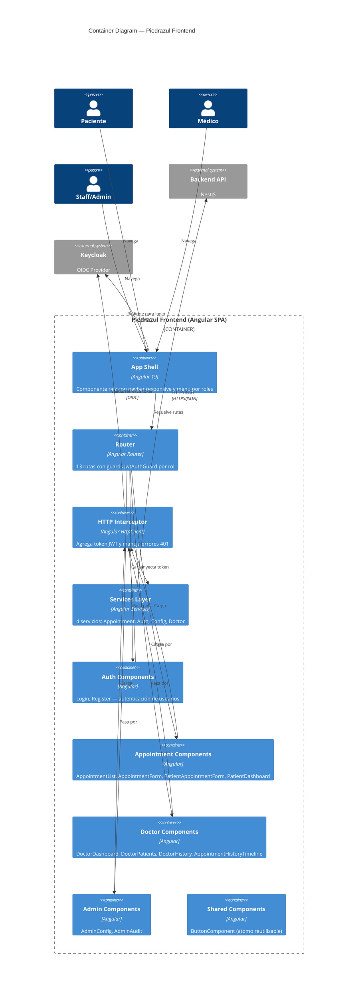

# Frontend — Diagrama de Contenedores (C4 L2)

```mermaid
C4Container
  title Container Diagram — Piedrazul Frontend

  Person(patient, "Paciente")
  Person(doctor, "Médico")
  Person(staff, "Staff/Admin")

  System_Ext(backend, "Backend API", "NestJS")
  System_Ext(keycloak, "Keycloak", "OIDC Provider")

  Container_Boundary(frontend, "Piedrazul Frontend (Angular SPA)") {
    Container(app_shell, "App Shell", "Angular 19", "Componente raíz con navbar responsive y menú por roles")
    Container(routing, "Router", "Angular Router", "13 rutas con guards JwtAuthGuard por rol")
    Container(auth_interceptor, "HTTP Interceptor", "Angular HttpClient", "Agrega token JWT y maneja errores 401")
    Container(services, "Services Layer", "Angular Services", "4 servicios: Appointment, Auth, Config, Doctor")
    Container(components_auth, "Auth Components", "Angular", "Login, Register — autenticación de usuarios")
    Container(components_appt, "Appointment Components", "Angular", "AppointmentList, AppointmentForm, PatientAppointmentForm, PatientDashboard")
    Container(components_doctor, "Doctor Components", "Angular", "DoctorDashboard, DoctorPatients, DoctorHistory, AppointmentHistoryTimeline")
    Container(components_admin, "Admin Components", "Angular", "AdminConfig, AdminAudit")
    Container(components_shared, "Shared Components", "Angular", "ButtonComponent (atomo reutilizable)")
  }

  Rel(patient, app_shell, "Navega")
  Rel(doctor, app_shell, "Navega")
  Rel(staff, app_shell, "Navega")

  Rel(app_shell, routing, "Resuelve rutas")
  Rel(routing, components_auth, "Carga")
  Rel(routing, components_appt, "Carga")
  Rel(routing, components_doctor, "Carga")
  Rel(routing, components_admin, "Carga")

  Rel(components_auth, auth_interceptor, "Pasa por")
  Rel(components_appt, auth_interceptor, "Pasa por")
  Rel(components_doctor, auth_interceptor, "Pasa por")
  Rel(components_admin, auth_interceptor, "Pasa por")

  Rel(auth_interceptor, services, "Inyecta token")
  Rel(services, backend, "HTTP/REST", "HTTPS/JSON")
  Rel(auth_interceptor, keycloak, "Valida/refresca token", "OIDC")
  Rel(app_shell, keycloak, "Redirige para login", "OIDC")
```
