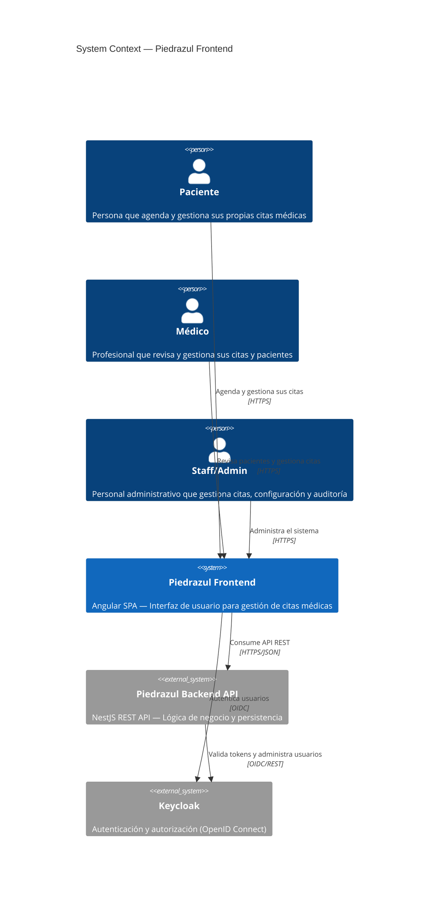

# Frontend — Diagrama de Contexto (C4 L1)

```mermaid
C4Context
  title System Context — Piedrazul Frontend

  Person(patient, "Paciente", "Persona que agenda y gestiona sus propias citas médicas")
  Person(doctor, "Médico", "Profesional que revisa y gestiona sus citas y pacientes")
  Person(staff, "Staff/Admin", "Personal administrativo que gestiona citas, configuración y auditoría")

  System(frontend, "Piedrazul Frontend", "Angular SPA — Interfaz de usuario para gestión de citas médicas")

  System_Ext(backend, "Piedrazul Backend API", "NestJS REST API — Lógica de negocio y persistencia")
  System_Ext(keycloak, "Keycloak", "Autenticación y autorización (OpenID Connect)")

  Rel(patient, frontend, "Agenda y gestiona sus citas", "HTTPS")
  Rel(doctor, frontend, "Revisa pacientes y gestiona citas", "HTTPS")
  Rel(staff, frontend, "Administra el sistema", "HTTPS")

  Rel(frontend, backend, "Consume API REST", "HTTPS/JSON")
  Rel(frontend, keycloak, "Autentica usuarios", "OIDC")
  Rel(backend, keycloak, "Valida tokens y administra usuarios", "OIDC/REST")
```
