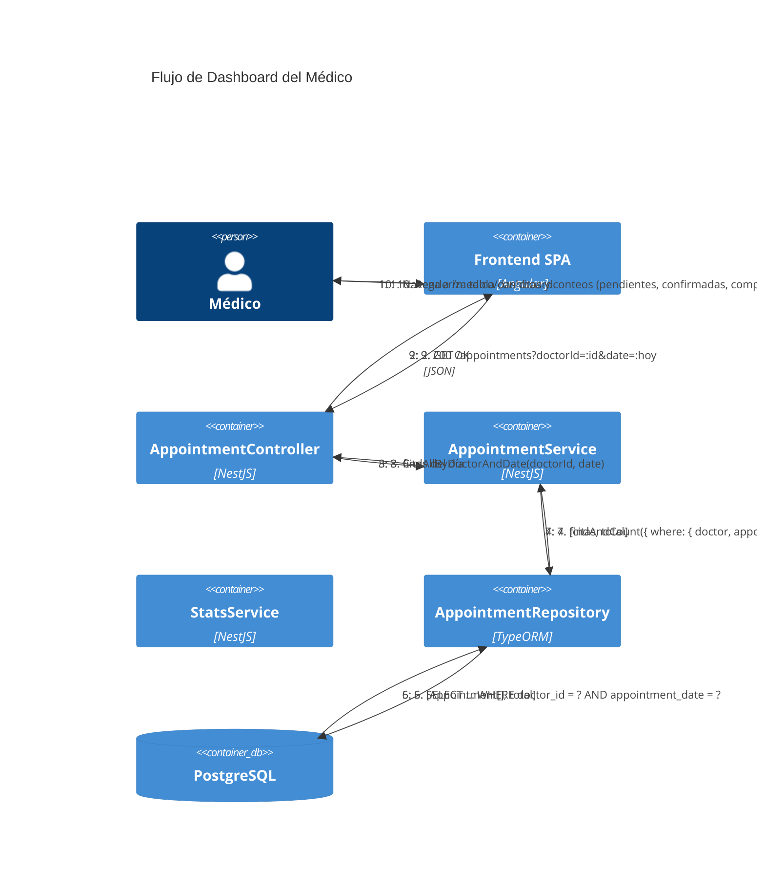

# Flujo de Dashboard del Médico

```mermaid
C4Dynamic
  title Flujo de Dashboard del Médico

  Person(doctor, "Médico")
  Container(spa, "Frontend SPA", "Angular")
  Container(appt_controller, "AppointmentController", "NestJS")
  Container(appt_service, "AppointmentService", "NestJS")
  Container(stats_service, "StatsService", "NestJS")
  Container(appt_repo, "AppointmentRepository", "TypeORM")
  ContainerDb(postgres, "PostgreSQL")

  Rel(doctor, spa, "1. Navega a /medico/dashboard")
  Rel(spa, appt_controller, "2. GET /appointments?doctorId=:id&date=:hoy")
  Rel(appt_controller, appt_service, "3. findAllByDoctorAndDate(doctorId, date)")
  Rel(appt_service, appt_repo, "4. findAndCount({ where: { doctor, appointmentDate }, relations: [patient] })")
  Rel(appt_repo, postgres, "5. SELECT ... WHERE doctor_id = ? AND appointment_date = ?")
  Rel(postgres, appt_repo, "6. [Appointment[], total]")
  Rel(appt_repo, appt_service, "7. [citas, total]")
  Rel(appt_service, appt_controller, "8. Citas del día")
  Rel(appt_controller, spa, "9. 200 OK", "JSON")
  Rel(spa, doctor, "10. Renderiza tabla con citas y conteos (pendientes, confirmadas, completadas)")
```
