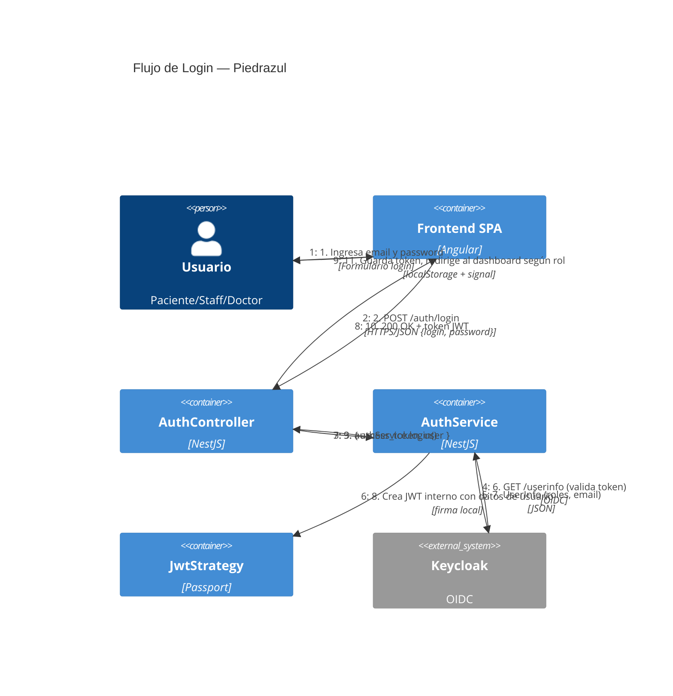

# Flujo de Autenticación (Login)

```mermaid
C4Dynamic
  title Flujo de Login — Piedrazul

  Person(user, "Usuario", "Paciente/Staff/Doctor")
  Container(spa, "Frontend SPA", "Angular")
  Container(auth_controller, "AuthController", "NestJS")
  Container(auth_service, "AuthService", "NestJS")
  Container(jwt_strategy, "JwtStrategy", "Passport")
  System_Ext(keycloak, "Keycloak", "OIDC")

  Rel(user, spa, "1. Ingresa email y password", "Formulario login")
  Rel(spa, auth_controller, "2. POST /auth/login", "HTTPS/JSON {login, password}")
  Rel(auth_controller, auth_service, "3. authService.login()")
  Rel(auth_service, keycloak, "4. Solicita token a Keycloak", "OIDC /token")
  Rel(keycloak, auth_service, "5. access_token + refresh_token", "JSON")
  Rel(auth_service, keycloak, "6. GET /userinfo (valida token)", "OIDC")
  Rel(keycloak, auth_service, "7. UserInfo (roles, email)", "JSON")
  Rel(auth_service, jwt_strategy, "8. Crea JWT interno con datos de usuario", "firma local")
  Rel(auth_service, auth_controller, "9. { access_token, user }")
  Rel(auth_controller, spa, "10. 200 OK + token JWT")
  Rel(spa, user, "11. Guarda token, redirige al dashboard según rol", "localStorage + signal")

  UpdateRelStyle(user, spa, $offsetX="-30", $offsetY="-10")
  UpdateRelStyle(spa, auth_controller, $offsetX="10", $offsetY="-10")
  UpdateRelStyle(auth_service, keycloak, $offsetY="-10")
```
