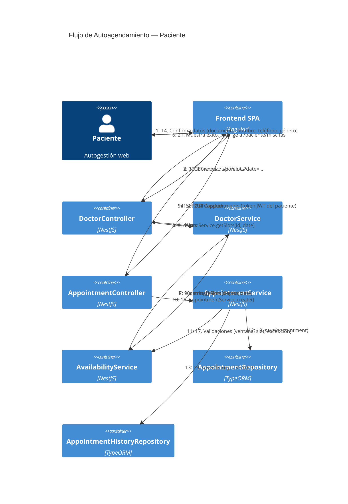

# Flujo de Autoagendamiento (Paciente Web)

```mermaid
C4Dynamic
  title Flujo de Autoagendamiento — Paciente

  Person(patient, "Paciente", "Autogestión web")
  Container(spa, "Frontend SPA", "Angular")
  Container(doc_controller, "DoctorController", "NestJS")
  Container(doc_service, "DoctorService", "NestJS")
  Container(appt_controller, "AppointmentController", "NestJS")
  Container(appt_service, "AppointmentService", "NestJS")
  Container(avail_service, "AvailabilityService", "NestJS")
  Container(appt_repo, "AppointmentRepository", "TypeORM")
  Container(history_repo, "AppointmentHistoryRepository", "TypeORM")

  Rel(patient, spa, "1. Ingresa a /paciente/agendar")
  Rel(spa, doc_controller, "2. GET /doctors")
  Rel(doc_controller, doc_service, "3. doctorService.findAll()")
  Rel(doc_service, doc_controller, "4. Doctor[]")
  Rel(doc_controller, spa, "5. Lista de médicos")
  Rel(spa, patient, "6. Selecciona médico")

  Rel(spa, doc_controller, "7. GET /doctors/:id/slots?date=...")
  Rel(doc_controller, doc_service, "8. doctorService.getSlots(id, date)")
  Rel(doc_service, avail_service, "9. generateSlots(doctor, date)")
  Rel(avail_service, doc_service, "10. string[] slots disponibles")
  Rel(doc_service, doc_controller, "11. Slots")
  Rel(doc_controller, spa, "12. Horarios disponibles")
  Rel(spa, patient, "13. Selecciona fecha y hora")

  Rel(patient, spa, "14. Confirma datos (documento, nombre, teléfono, género)")
  Rel(spa, appt_controller, "15. POST /appointments (token JWT del paciente)")
  Rel(appt_controller, appt_service, "16. appointmentService.create()")
  Rel(appt_service, avail_service, "17. Validaciones (ventana, slot, excepción)")
  Rel(appt_service, appt_repo, "18. save(appointment)")
  Rel(appt_service, history_repo, "19. save(history: CREATED)")
  Rel(appt_controller, spa, "20. 201 Created")
  Rel(spa, patient, "21. Muestra éxito, redirige a /paciente/miscitas")

  UpdateRelStyle(patient, spa, $offsetX="-40", $offsetY="-10")
```
