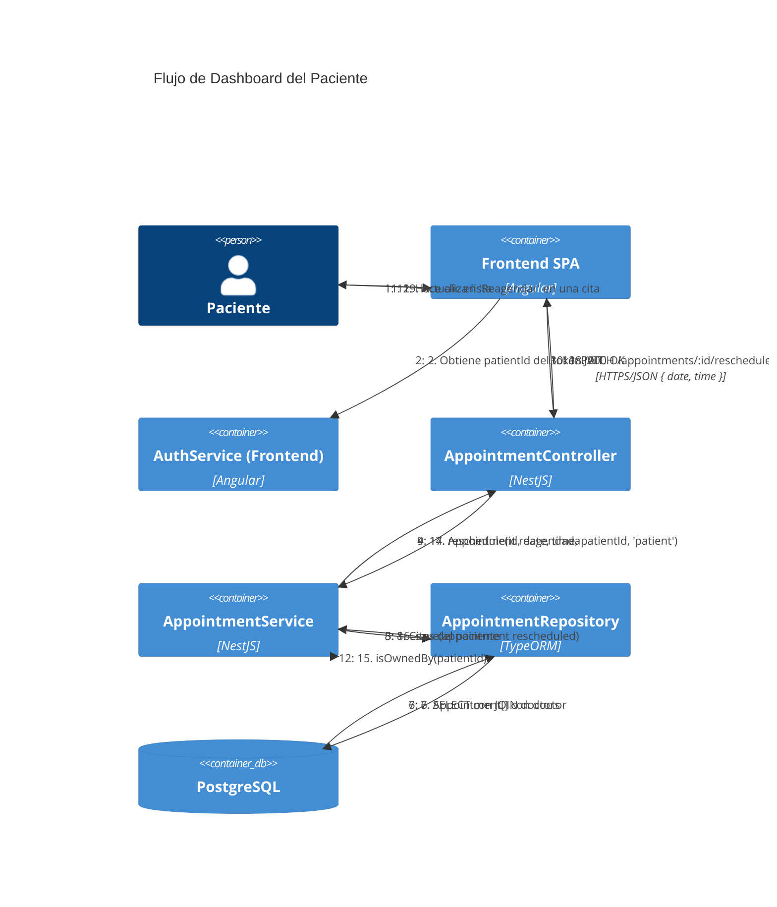

# Flujo de Dashboard del Paciente

```mermaid
C4Dynamic
  title Flujo de Dashboard del Paciente

  Person(patient, "Paciente")
  Container(spa, "Frontend SPA", "Angular")
  Container(auth_service, "AuthService (Frontend)", "Angular")
  Container(appt_controller, "AppointmentController", "NestJS")
  Container(appt_service, "AppointmentService", "NestJS")
  Container(appt_repo, "AppointmentRepository", "TypeORM")
  ContainerDb(postgres, "PostgreSQL")

  Rel(patient, spa, "1. Navega a /paciente/miscitas")
  Rel(spa, auth_service, "2. Obtiene patientId del token JWT")

  Rel(spa, appt_controller, "3. GET /appointments/patient/:patientId")
  Rel(appt_controller, appt_service, "4. findAllByPatient(patientId)")
  Rel(appt_service, appt_repo, "5. find({ where: { patient: { id } }, relations: [doctor], order: { appointmentDate: DESC } })")
  Rel(appt_repo, postgres, "6. SELECT con JOIN doctors")
  Rel(postgres, appt_repo, "7. Appointment[] con doctor")
  Rel(appt_repo, appt_service, "8. Citas del paciente")
  Rel(appt_service, appt_controller, "9. Appointment[]")
  Rel(appt_controller, spa, "10. 200 OK", "JSON")
  Rel(spa, patient, "11. Renderiza lista de citas con opciones: reagendar, cancelar")

  Rel(patient, spa, "12. Hace clic en 'Reagendar' en una cita")
  Rel(spa, appt_controller, "13. PATCH /appointments/:id/reschedule", "HTTPS/JSON { date, time }")
  Rel(appt_controller, appt_service, "14. reschedule(id, date, time, patientId, 'patient')")
  Rel(appt_service, appt_service, "15. isOwnedBy(patientId)")
  Rel(appt_service, appt_repo, "16. save(appointment rescheduled)")
  Rel(appt_service, appt_controller, "17. Appointment reagendada")
  Rel(appt_controller, spa, "18. 200 OK")
  Rel(spa, patient, "19. Actualiza lista")
```
