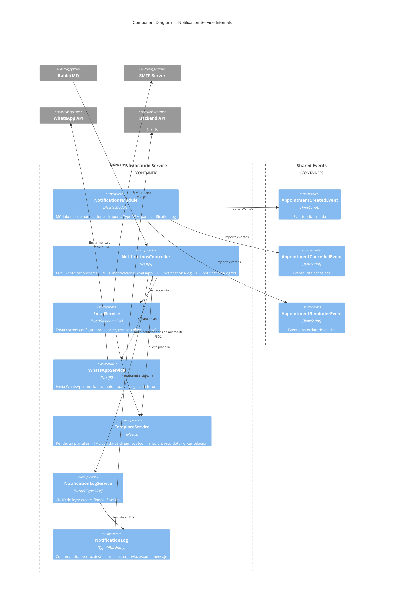

# Notification Service — Diagrama de Componentes (C4 L3)

```mermaid
C4Component
  title Component Diagram — Notification Service Internals

  System_Ext(rabbitmq, "RabbitMQ")
  System_Ext(smtp, "SMTP Server")
  System_Ext(whatsapp_api, "WhatsApp API")
  System_Ext(backend, "Backend API", "NestJS")

  Container_Boundary(notification_svc, "Notification Service") {
    Component(module, "NotificationsModule", "NestJS Module", "Módulo raíz de notificaciones, importa TypeORM para NotificationLog")
    Component(controller, "NotificationsController", "NestJS", "POST /notifications/email, POST /notifications/whatsapp, GET /notifications/log, GET /notifications/log/:id")
    Component(email_svc, "EmailService", "NestJS/nodemailer", "Envía correo: configura transporter, compila plantilla, envía")
    Component(whatsapp_svc, "WhatsAppService", "NestJS", "Envía WhatsApp: mock/placeholder para integración futura")
    Component(template_svc, "TemplateService", "NestJS", "Renderiza plantillas HTML con datos dinámicos (confirmación, recordatorio, cancelación)")
    Component(log_svc, "NotificationLogService", "NestJS/TypeORM", "CRUD de logs: create, findAll, findOne")
    Component(log_entity, "NotificationLog", "TypeORM Entity", "Columnas: id, evento, destinatario, fecha_envio, estado, mensaje")
  }

  Container_Boundary(shared_events, "Shared Events") {
    Component(event_created, "AppointmentCreatedEvent", "TypeScript", "Evento: cita creada")
    Component(event_cancelled, "AppointmentCancelledEvent", "TypeScript", "Evento: cita cancelada")
    Component(event_reminder, "AppointmentReminderEvent", "TypeScript", "Evento: recordatorio de cita")
  }

  Rel(rabbitmq, controller, "Entrega eventos")
  Rel(controller, email_svc, "Dispara envío")
  Rel(controller, whatsapp_svc, "Dispara envío")
  Rel(controller, template_svc, "Solicita plantilla")
  Rel(controller, log_svc, "Registra resultado")

  Rel(email_svc, template_svc, "Compila plantilla")
  Rel(email_svc, smtp, "Envía correo", "SMTP")
  Rel(whatsapp_svc, whatsapp_api, "Envía mensaje", "REST/HTTPS")
  Rel(log_svc, log_entity, "Persiste en BD")
  Rel(log_entity, backend, "Tabla notificaciones en misma BD", "SQL")

  Rel(module, event_created, "Importa eventos")
  Rel(module, event_cancelled, "Importa eventos")
  Rel(module, event_reminder, "Importa eventos")
```
