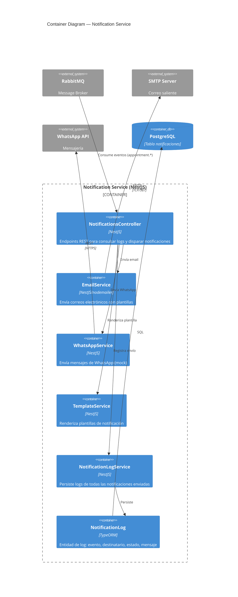

# Notification Service — Diagrama de Contenedores (C4 L2)

```mermaid
C4Container
  title Container Diagram — Notification Service

  System_Ext(rabbitmq, "RabbitMQ", "Message Broker")
  System_Ext(smtp, "SMTP Server", "Correo saliente")
  System_Ext(whatsapp_api, "WhatsApp API", "Mensajería")

  Container_Boundary(notification_svc, "Notification Service (NestJS)") {
    Container(controller, "NotificationsController", "NestJS", "Endpoints REST para consultar logs y disparar notificaciones")
    Container(email_svc, "EmailService", "NestJS/nodemailer", "Envía correos electrónicos con plantillas")
    Container(whatsapp_svc, "WhatsAppService", "NestJS", "Envía mensajes de WhatsApp (mock)")
    Container(template_svc, "TemplateService", "NestJS", "Renderiza plantillas de notificación")
    Container(log_svc, "NotificationLogService", "NestJS", "Persiste logs de todas las notificaciones enviadas")
    Container(log_entity, "NotificationLog", "TypeORM", "Entidad de log: evento, destinatario, estado, mensaje")
  }

  ContainerDb(postgres, "PostgreSQL", "Tabla notificaciones")

  Rel(rabbitmq, controller, "Consume eventos (appointment.*)")
  Rel(controller, email_svc, "Envía email")
  Rel(controller, whatsapp_svc, "Envía WhatsApp")
  Rel(controller, template_svc, "Renderiza plantilla")
  Rel(controller, log_svc, "Registra envío")

  Rel(email_svc, smtp, "SMTP", "TCP/587")
  Rel(whatsapp_svc, whatsapp_api, "REST", "HTTPS")
  Rel(log_svc, log_entity, "Persiste")
  Rel(log_entity, postgres, "SQL")
```
