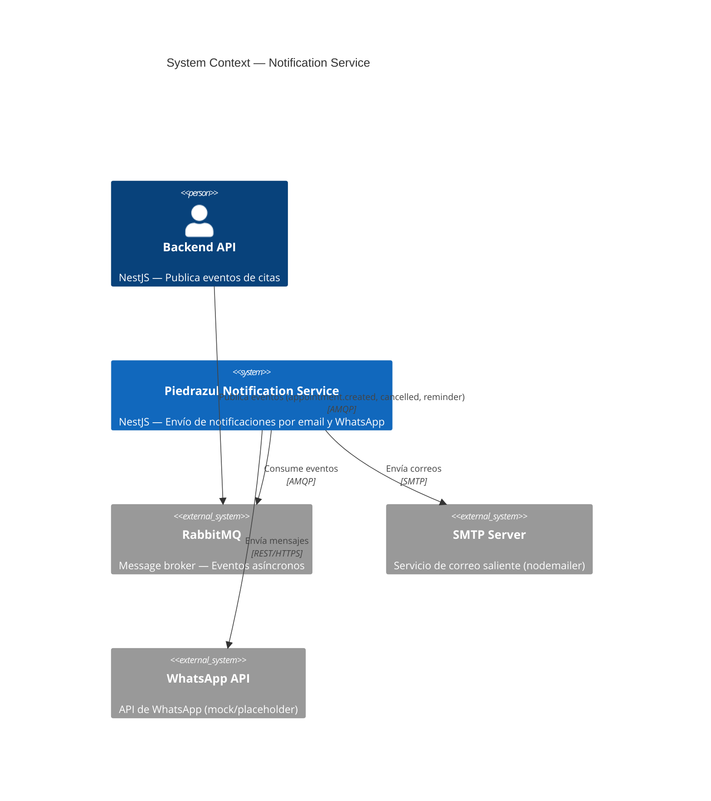

# Notification Service — Diagrama de Contexto (C4 L1)

```mermaid
C4Context
  title System Context — Notification Service

  Person(backend, "Backend API", "NestJS — Publica eventos de citas")

  System(notification_svc, "Piedrazul Notification Service", "NestJS — Envío de notificaciones por email y WhatsApp")

  System_Ext(rabbitmq, "RabbitMQ", "Message broker — Eventos asíncronos")
  System_Ext(smtp, "SMTP Server", "Servicio de correo saliente (nodemailer)")
  System_Ext(whatsapp_api, "WhatsApp API", "API de WhatsApp (mock/placeholder)")

  Rel(backend, rabbitmq, "Publica eventos (appointment.created, cancelled, reminder)", "AMQP")
  Rel(notification_svc, rabbitmq, "Consume eventos", "AMQP")
  Rel(notification_svc, smtp, "Envía correos", "SMTP")
  Rel(notification_svc, whatsapp_api, "Envía mensajes", "REST/HTTPS")
```
