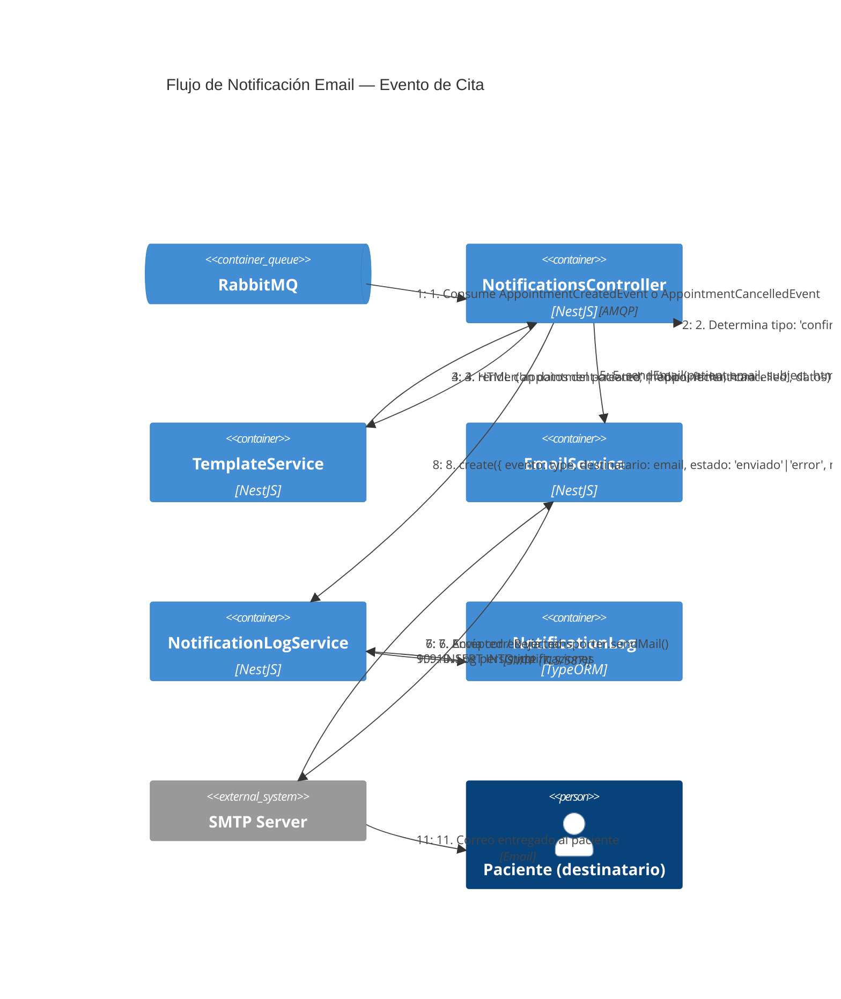

# Flujo de Notificación por Email (Creación/Cancelación)

```mermaid
C4Dynamic
  title Flujo de Notificación Email — Evento de Cita

  ContainerQueue(rabbitmq, "RabbitMQ")
  Container(notif_controller, "NotificationsController", "NestJS")
  Container(template_svc, "TemplateService", "NestJS")
  Container(email_svc, "EmailService", "NestJS")
  Container(log_svc, "NotificationLogService", "NestJS")
  Container(log_entity, "NotificationLog", "TypeORM")
  System_Ext(smtp, "SMTP Server")
  Person(patient, "Paciente (destinatario)")

  Rel(rabbitmq, notif_controller, "1. Consume AppointmentCreatedEvent o AppointmentCancelledEvent", "AMQP")

  Rel(notif_controller, notif_controller, "2. Determina tipo: 'confirmación' o 'cancelación'")

  Rel(notif_controller, template_svc, "3. render('appointment-created' | 'appointment-cancelled', datos)")
  Rel(template_svc, notif_controller, "4. HTML con datos del paciente, médico, fecha, hora")

  Rel(notif_controller, email_svc, "5. sendEmail(patient.email, subject, html)")
  Rel(email_svc, smtp, "6. Envía correo vía transporter.sendMail()", "SMTP (TLS/587)")
  Rel(smtp, email_svc, "7. Accepted / Rejected")

  Rel(notif_controller, log_svc, "8. create({ evento: type, destinatario: email, estado: 'enviado'|'error', mensaje })")
  Rel(log_svc, log_entity, "9. INSERT INTO notificaciones")
  Rel(log_entity, log_svc, "10. Log persistido")

  Rel(smtp, patient, "11. Correo entregado al paciente", "Email")
```
