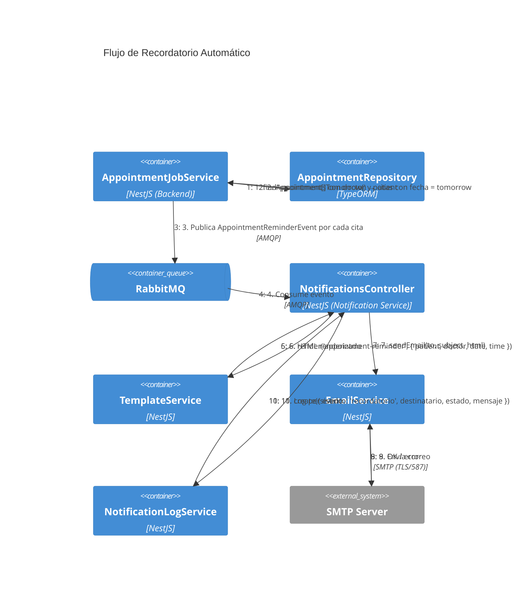

# Flujo de Recordatorio Automático de Citas

```mermaid
C4Dynamic
  title Flujo de Recordatorio Automático

  Container(job_service, "AppointmentJobService", "NestJS (Backend)")
  Container(appt_repo, "AppointmentRepository", "TypeORM")
  ContainerQueue(rabbitmq, "RabbitMQ")
  Container(notif_controller, "NotificationsController", "NestJS (Notification Service)")
  Container(template_svc, "TemplateService", "NestJS")
  Container(email_svc, "EmailService", "NestJS")
  Container(log_svc, "NotificationLogService", "NestJS")
  System_Ext(smtp, "SMTP Server")

  Rel(job_service, appt_repo, "1. findAppointmentsTomorrow() → citas con fecha = tomorrow")
  Rel(appt_repo, job_service, "2. Appointment[] con doctor y patient")

  Rel(job_service, rabbitmq, "3. Publica AppointmentReminderEvent por cada cita", "AMQP")
  Rel(rabbitmq, notif_controller, "4. Consume evento", "AMQP")

  Rel(notif_controller, template_svc, "5. render('appointment-reminder', { patient, doctor, date, time })")
  Rel(template_svc, notif_controller, "6. HTML renderizado")

  Rel(notif_controller, email_svc, "7. sendEmail(to, subject, html)")
  Rel(email_svc, smtp, "8. Envía correo", "SMTP (TLS/587)")
  Rel(smtp, email_svc, "9. OK / error")

  Rel(notif_controller, log_svc, "10. create({ evento: 'recordatorio', destinatario, estado, mensaje })")
  Rel(log_svc, notif_controller, "11. Log persistido")

  UpdateRelStyle(job_service, appt_repo, $offsetX="-20")
  UpdateRelStyle(job_service, rabbitmq, $offsetY="-10")
```
